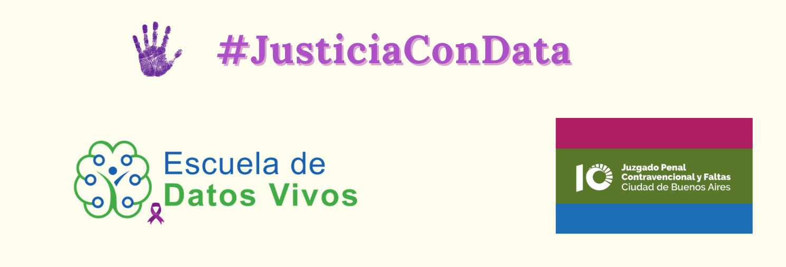

El informe se realiza en el marco del desafío __"Analizando denuncias relacionadas a la violencia de género"__ propuesto por la [__Escuela de Datos Vivos__](https://escueladedatosvivos.ai/). 

Utiliza los datos proporcionados por el [__Juzgado Penal Contravencional y Faltas N° 10 de la Ciudad de Buenos Aires__](https://twitter.com/jpcyf10) sobre denuncias y casos relacionados con violencia de género.

El objetivo es poder analizar los casos y encontrar patrones para detectar los comportamientos más comúnmente denunciados.

# RESOLUCIONES

## Descripción y resumen inicial

Existe un marcado __aumento de la cantidad de resoluciones__ del Juzgado durante el período __2016-2019__.

El incremento de la resoluciones entre los extremos del período mencionado es del __568%__.

__2020__ es un año __atípico__ a partir de la pandemia de Covid-19 y las posteriores medidas adoptadas por el gobierno nacional en el marco del ASPO.

<!--html_preserve-->

<!--/html_preserve-->

Si analizamos la proporción de resoluciones año por año según la competencia del juzgado, se observa un __aumento progresivo__ y sostenido de la __materia penal__, pasando de un 43% del total de las resoluciones en 2016 al 73% en 2020.

__Comportamiento opuesto__ es el que presenta la __material Contravencional__, con una caída de 32 puntos porcentuales.

<!--html_preserve-->

<!--/html_preserve-->

Al explorar las conductas relativas a los hechos denunciados, las __amenazas__ representan el 17%.

Son destacables también conductas tales como:
* Conducir bajo efectos del alcohol o estupefacientes

* Incumplimientos de clausuras

* Hostigamiento

*	Material de abuso y explotación de menores (mesnna masnna)

<!--html_preserve-->

<!--/html_preserve-->

## Violencia de Género

Las conductas imputadas se encuentran dentro de un contexto de __violencia de género__ en el __28% de los casos__.

<!-- -->

## Tipos de violencia

Las declaraciones presentan variados índices de los tipos de violencia contemplados en los casos.

La violencia __psicológica__ y __simbólica__ aparecen en la gran __mayoría__ de los casos (91%).

__Más de la mitad__ de los casos presentan violencia __física__ (54%).

Es menor, aunque de importancia la presencia de violencia ecónomica y social (22% y 15% respectivamente).

<!-- --><!-- --><!-- --><!-- --><!-- --><!-- --><!-- -->

## Patrones de violencia

Analizando los distintos tipos de violencia que se presentan, podemos determinar __patrones de conducta__.

Para esto utilizamos un _análisis de cluster_. El modelo nos permite encontrar _similitudes_ y agrupar conductas mostrando patrones comunes.

Se observan tres grupos:

* Cluster 1: (Peso 22%) Utilización de violencia económica y sexual.

* Cluster 2: (Peso 34%) Utilización de violencia psicológica, social y simbólica.

* Cluster 3: (Peso 44%) Utilización de violencia física, psicológica, ambiental y simbólica.

Esto podría indicarnos que los acusados del primer cluster buscan ejercer una __dominación mediante el poder__, los del segundo cluster lo hacen a través de la __manipulación__ y los del tercer cluster se vuelcan más hacia __la violencia__.

<!-- -->

## Semántica de la violencia

Un análisis más __cualitativo__ sobre la violencia que presentan los casos se observa en la transcripción de las frases descriptas por la víctima como la agresión verbal sufrida.

Se puede observar claramente el uso de un __lenguaje denigrante__ utilizado como __amenaza__ de muerte y lesiones.

Es claro el intento de imponer una __posición de poder y autoridad__ sobre la víctima.

<!-- -->

# PERFIL DEL ACUSADO

__Ocho de cada diez__ acusados son __hombres argentinos__.

El 55% tiene un nivel de __instrucción secundaria__ (tanto incompleta, en curso o finalizada). Si abrimos un poco más al análisis, podemos ver que __3 de cada 4 acusados tiene niveles básicos__ de instrucción.

Respecto de la edad, el perfil más habitual es entre los __25 y 34 años__, cinco puntos mayor entre los acusados masculinos. Si sumamos el tramo siguiente, vemos que el 60% de los acusados se encuentran entre los __25 y 44 años__.

<!-- -->

<!-- -->

<!-- -->

<!--html_preserve-->

<!--/html_preserve-->

# PERFIL DEL DENUNCIANTE

Se observa claramente que el __denunciante es mujer__, y 8 de cada 10 son __argentinas__.

Los niveles de instrucción son __levementes mayores__ a los de los denunciados.

El nivel secundario asciende al 63% y el nivel terciario-universitario al 22%.

El __perfil étareo es levemente más joven__. Entre los 25 y 44 años, el porcentaje de denunciantes __asciende al 66%__, seis puntos por encima del perfil etáreo de los acusados. 

<!-- -->

<!-- -->

<!-- -->

<!--html_preserve-->

<!--/html_preserve-->

# RELACIONES DE PARTES

## Género

La relación es casi en __exclusividad__ entre un __hombre acusado y una mujer denunciante__, algo que por lo expuesto anteriormente sólo confirma lo dicho.

<!--html_preserve-->

<!--/html_preserve-->

## Nacionalidad

En general, la relación entre acusado y denunciante es __entre argentinos__.

Algo menor, pero para destacar es la relación entre sudamericanos.

Y también se observan relaciones entre acusado argentino y denunciante sudamericana y viceversa.

<!--html_preserve-->

<!--/html_preserve-->

## Nivel de instrucción

La principal relación a nivel de instrucción se encuentra entre partes con __secundario incompleto o en curso__.

En general se observan __mayor cantidad de relaciones en niveles de instrucción bajo__, siendo escasa o nula en niveles de alta instrucción.

<!--html_preserve-->

<!--/html_preserve-->

## Edad

La edad media de los acusados es de 37 años, similar a la de las denunciantes, que se ubican en 36 años.

Se observan dos aspectos de importancia:

1. Si bien a medida que crece la edad de los acusados también lo hace la de las denunciantes, __es mayor el crecimiento de la edad__ de los primeros. Es decir, que por encima de la media de ambas partes, se encuentra a __acusados mayores a sus víctimas__ (_sector derecho de los cuadrantes_).

2. Sobre las medias de edad y por debajo de estas, la relación entre las edades es mucho más similar y pareja (_cuadrante inferior izquierdo_).

<!--html_preserve-->

<script type="application/json" data-for="htmlwidget-b515167ea6a3768c6ae9">{"x":{"data":[{"x":[17,50,25,29,37,55,57,30,42,39,28,27,33,39,31,35,27,39,26,30,29,37,24,29,29,58,19,24,25,25,44,44,38,27,44,44,32,38,25,24,39,38,48,32,32,32,55,39,60,25,50,35,27,46,34,36,26,29,43,30,51,38,29,61,26,29,67,35,31,31,33,45,32,24,23,23,41,28,45,42,67,29,29,46,46,29,38,28,26,32,23,40,40,23,24,34,34,57,24,19,62,39,29,53,75,60,29,25,27,35,29,62,33,43,53,32,26,27,27,27,26,42,36,23,75,29,46,27,43,34,46,24,42,27,40,29,29,34,60,26,62,40,40,36,36,26,20,32,45,26,60,27,52,35,35,35,35,28,45,76,47,47,47,47,41,41,67,44,44,44,44,30,26,26,26,40,40,40,22,55,40,25,40,36,55,59,59,66,35,33,27,40,26,33,60,27,38,68,29,36,25,25,25,25,60,60,37,19,46,46,53,34,59,49,28,34,30,30,36,34,38,27,25,25,25,30,47,68,30,46,68,68,33,46,62,51,51,22,24,59,49,68,21,25,25,27,33,25,32,33,27,27,31,55,26,51,26,25,25,54,30,30,30,47,22,22,68,41,36,35,40,46,29,33,35,29,29,55,44,25,41,41,18,25,30,30,44,45,68,24,36,37,24,24,21,38,38,38,38,36,31,30,25,25,44,41,39,44,27,49,49,26,29,29,35,34,32,44,37,27,27,35,35,35,35,44,36,36,36,44,31,31,37,43,32,33,26,24,24,22,43,35,22,22,40,25,30,41,41,47,47,26,44,44,44,44,44,44,27,25,29,29,28,33,33,42,42,21,21,24,44,69,30,30,54,54,86,86,86,24,33,45,45,45,45,28,28,28,45,36,36,40,39,39,45,45,24,24,24,26,22,22,28,28,28,25,29,29,29,29,27,54,54,29,21,21,21,47,47,27,27,27,27,44,44,42,30,30,44,44,44,44,44,22,37,52,37,67,27,34,27,60,36,38,38,43,36,20,20,22,22,22,21,20,34,34,31,41,41,37,37,39,39,28,28,38,26,20,60,24,53,53,53,28,28,28,57,53,22,46,46,45,36,32,32,32,37,34,21,41,41,41,18,18,18,45,32,32,28,28,28,43,29,29,29,26,26,26,29,29,53,26,46,46,33,37,37,26,29,46,46,23,23,23,30,30,25,25,38,38,38,41,41,35,44,50,50,50,30,30,30,33,33,44,30,55,33,33,27,23,30,45,45,79,37,37,24,32,37,31,56,57,57,57,57,36,33,43,43,37,21,32,32,32,28,28,75,45,41,50,31,20,20,34,34,37,37,40,40,41,68,32,27,27,27,27,41,32,32,32,40,40,44,49,43,42,33,33,33,33,45,33,33,33,40,34,77,37,30,42,31,41,31,44,44,46,38,38,73,44,24,52,29,73,33,38,33,53,39,48,48,41,45,30,30,41,32,22,38,44,26,26,38,28,35,32,33,33,33,29,33,33,33,33,33,20,20,48,48,48,32,32,32,32,56,37,38,47,34,34,43,35,24,24,27,26,73,39,38,38,38,38,38,38,22,22,22,22,22,22,22,36,58,58,41,41,27,27,58,37,22,38,32,56,56,56,56,38,29,30,79,77,77,29,37,36,40,40,45,38,42,49,36,35,47,34,34,41,36,36,27,22,36,30,30,36,33,38,38,38,44,30,54,23,45,47,53,47,38,37,38,38,22,24,32,44,44,50,42,33,28,36,36,27,33,41,56,56,32,25,33,29,57,57,57,57,41,35,35,61,36,39,27,34,20,33,33,60,44,44,27,27],"y":[17,23,52,22,38,40,56,23,42,35,32,35,35,35,32,29,25,29,32,29,23,38,22,50,27,50,29,31,23,23,33,33,33,35,33,33,36,39,42,22,35,57,42,30,30,30,40,33,76,19,42,36,33,38,45,37,58,26,44,33,31,39,22,50,25,23,44,34,26,26,36,42,34,31,48,48,36,27,25,83,44,24,24,38,38,26,57,32,23,36,48,36,36,30,22,45,45,56,33,29,48,33,22,32,40,76,22,42,24,36,23,32,33,56,40,26,17,37,37,35,32,47,33,27,40,26,41,31,44,37,46,22,29,24,73,23,23,34,54,17,32,36,36,33,33,32,19,34,25,58,56,26,53,34,34,34,34,27,25,35,40,40,40,40,37,37,44,48,48,48,48,38,24,28,28,36,36,36,18,40,36,42,36,36,28,57,36,47,66,31,35,36,17,36,46,35,57,51,35,30,25,25,25,25,76,76,19,29,38,38,40,45,36,50,27,41,38,38,30,32,57,37,25,25,25,27,44,51,27,28,51,51,48,28,37,30,30,22,20,57,42,51,46,25,25,24,31,25,32,36,24,24,36,28,25,30,58,20,20,39,22,22,22,40,18,18,51,37,42,34,36,38,26,29,17,24,24,44,26,24,37,37,26,24,27,26,38,25,51,20,42,38,58,33,20,42,42,42,42,47,42,27,23,23,26,38,31,26,35,50,50,28,23,23,34,27,62,38,20,44,44,17,17,17,17,38,26,36,36,76,22,22,19,41,25,30,28,58,58,24,41,34,29,29,49,29,27,45,45,50,50,58,38,38,38,38,38,38,44,20,26,26,38,30,30,53,53,19,19,26,38,47,30,30,58,58,68,68,68,26,37,39,39,39,39,31,37,37,58,35,35,32,36,36,39,39,20,20,26,58,21,21,31,37,37,23,35,35,35,35,35,39,39,52,16,28,28,50,50,27,27,27,27,38,38,47,38,38,38,38,38,38,38,18,42,53,42,44,44,32,26,51,36,42,42,41,42,49,49,21,21,18,28,49,32,32,33,30,30,27,27,31,31,27,27,32,17,49,46,20,43,43,43,31,37,37,55,43,20,17,17,58,36,35,35,35,31,32,59,34,34,34,18,18,18,42,30,29,31,37,37,56,27,27,27,23,23,23,35,35,43,58,17,17,33,35,35,35,35,34,34,39,39,39,38,38,52,52,38,38,38,29,29,30,38,37,37,37,18,18,18,48,31,26,38,28,16,16,44,39,27,58,58,58,31,31,26,25,39,33,33,55,55,55,55,42,26,33,33,27,59,35,35,35,27,27,40,25,35,42,33,20,20,36,36,39,39,49,49,40,51,35,44,44,44,44,40,32,32,32,49,49,40,50,56,35,35,35,35,35,58,35,35,35,63,27,31,42,27,47,28,35,33,26,26,34,37,37,37,38,26,53,21,58,30,37,30,43,24,25,25,31,44,38,38,30,25,18,18,26,26,26,38,31,30,35,33,33,33,35,33,33,33,24,24,23,23,42,42,42,30,30,30,30,33,39,34,40,32,32,56,34,58,58,26,26,59,24,41,41,41,41,41,41,20,20,20,20,20,20,18,42,53,53,32,32,15,15,53,21,18,41,29,33,33,33,33,42,19,27,58,31,31,19,35,42,63,63,77,36,47,40,42,46,33,64,64,29,32,33,25,25,30,30,30,32,36,38,38,38,38,26,39,39,77,50,43,40,38,42,42,42,20,26,29,45,45,43,29,35,31,35,35,27,16,37,33,33,25,17,26,29,55,55,55,55,29,47,48,14,33,43,27,64,18,24,24,51,38,38,26,26],"text":["EDAD ACUSADO: 17 EDAD DENUNCIANTE: 17","EDAD ACUSADO: 50 EDAD DENUNCIANTE: 23","EDAD ACUSADO: 25 EDAD DENUNCIANTE: 52","EDAD ACUSADO: 29 EDAD DENUNCIANTE: 22","EDAD ACUSADO: 37 EDAD DENUNCIANTE: 38","EDAD ACUSADO: 55 EDAD DENUNCIANTE: 40","EDAD ACUSADO: 57 EDAD DENUNCIANTE: 56","EDAD ACUSADO: 30 EDAD DENUNCIANTE: 23","EDAD ACUSADO: 42 EDAD DENUNCIANTE: 42","EDAD ACUSADO: 39 EDAD DENUNCIANTE: 35","EDAD ACUSADO: 28 EDAD DENUNCIANTE: 32","EDAD ACUSADO: 27 EDAD DENUNCIANTE: 35","EDAD ACUSADO: 33 EDAD DENUNCIANTE: 35","EDAD ACUSADO: 39 EDAD DENUNCIANTE: 35","EDAD ACUSADO: 31 EDAD DENUNCIANTE: 32","EDAD ACUSADO: 35 EDAD DENUNCIANTE: 29","EDAD ACUSADO: 27 EDAD DENUNCIANTE: 25","EDAD ACUSADO: 39 EDAD DENUNCIANTE: 29","EDAD ACUSADO: 26 EDAD DENUNCIANTE: 32","EDAD ACUSADO: 30 EDAD DENUNCIANTE: 29","EDAD ACUSADO: 29 EDAD DENUNCIANTE: 23","EDAD ACUSADO: 37 EDAD DENUNCIANTE: 38","EDAD ACUSADO: 24 EDAD DENUNCIANTE: 22","EDAD ACUSADO: 29 EDAD DENUNCIANTE: 50","EDAD ACUSADO: 29 EDAD DENUNCIANTE: 27","EDAD ACUSADO: 58 EDAD DENUNCIANTE: 50","EDAD ACUSADO: 19 EDAD DENUNCIANTE: 29","EDAD ACUSADO: 24 EDAD DENUNCIANTE: 31","EDAD ACUSADO: 25 EDAD DENUNCIANTE: 23","EDAD ACUSADO: 25 EDAD DENUNCIANTE: 23","EDAD ACUSADO: 44 EDAD DENUNCIANTE: 33","EDAD ACUSADO: 44 EDAD DENUNCIANTE: 33","EDAD ACUSADO: 38 EDAD DENUNCIANTE: 33","EDAD ACUSADO: 27 EDAD DENUNCIANTE: 35","EDAD ACUSADO: 44 EDAD DENUNCIANTE: 33","EDAD ACUSADO: 44 EDAD DENUNCIANTE: 33","EDAD ACUSADO: 32 EDAD DENUNCIANTE: 36","EDAD ACUSADO: 38 EDAD DENUNCIANTE: 39","EDAD ACUSADO: 25 EDAD DENUNCIANTE: 42","EDAD ACUSADO: 24 EDAD DENUNCIANTE: 22","EDAD ACUSADO: 39 EDAD DENUNCIANTE: 35","EDAD ACUSADO: 38 EDAD DENUNCIANTE: 57","EDAD ACUSADO: 48 EDAD DENUNCIANTE: 42","EDAD ACUSADO: 32 EDAD DENUNCIANTE: 30","EDAD ACUSADO: 32 EDAD DENUNCIANTE: 30","EDAD ACUSADO: 32 EDAD DENUNCIANTE: 30","EDAD ACUSADO: 55 EDAD DENUNCIANTE: 40","EDAD ACUSADO: 39 EDAD DENUNCIANTE: 33","EDAD ACUSADO: 60 EDAD DENUNCIANTE: 76","EDAD ACUSADO: 25 EDAD DENUNCIANTE: 19","EDAD ACUSADO: 50 EDAD DENUNCIANTE: 42","EDAD ACUSADO: 35 EDAD DENUNCIANTE: 36","EDAD ACUSADO: 27 EDAD DENUNCIANTE: 33","EDAD ACUSADO: 46 EDAD DENUNCIANTE: 38","EDAD ACUSADO: 34 EDAD DENUNCIANTE: 45","EDAD ACUSADO: 36 EDAD DENUNCIANTE: 37","EDAD ACUSADO: 26 EDAD DENUNCIANTE: 58","EDAD ACUSADO: 29 EDAD DENUNCIANTE: 26","EDAD ACUSADO: 43 EDAD DENUNCIANTE: 44","EDAD ACUSADO: 30 EDAD DENUNCIANTE: 33","EDAD ACUSADO: 51 EDAD DENUNCIANTE: 31","EDAD ACUSADO: 38 EDAD DENUNCIANTE: 39","EDAD ACUSADO: 29 EDAD DENUNCIANTE: 22","EDAD ACUSADO: 61 EDAD DENUNCIANTE: 50","EDAD ACUSADO: 26 EDAD DENUNCIANTE: 25","EDAD ACUSADO: 29 EDAD DENUNCIANTE: 23","EDAD ACUSADO: 67 EDAD DENUNCIANTE: 44","EDAD ACUSADO: 35 EDAD DENUNCIANTE: 34","EDAD ACUSADO: 31 EDAD DENUNCIANTE: 26","EDAD ACUSADO: 31 EDAD DENUNCIANTE: 26","EDAD ACUSADO: 33 EDAD DENUNCIANTE: 36","EDAD ACUSADO: 45 EDAD DENUNCIANTE: 42","EDAD ACUSADO: 32 EDAD DENUNCIANTE: 34","EDAD ACUSADO: 24 EDAD DENUNCIANTE: 31","EDAD ACUSADO: 23 EDAD DENUNCIANTE: 48","EDAD ACUSADO: 23 EDAD DENUNCIANTE: 48","EDAD ACUSADO: 41 EDAD DENUNCIANTE: 36","EDAD ACUSADO: 28 EDAD DENUNCIANTE: 27","EDAD ACUSADO: 45 EDAD DENUNCIANTE: 25","EDAD ACUSADO: 42 EDAD DENUNCIANTE: 83","EDAD ACUSADO: 67 EDAD DENUNCIANTE: 44","EDAD ACUSADO: 29 EDAD DENUNCIANTE: 24","EDAD ACUSADO: 29 EDAD DENUNCIANTE: 24","EDAD ACUSADO: 46 EDAD DENUNCIANTE: 38","EDAD ACUSADO: 46 EDAD DENUNCIANTE: 38","EDAD ACUSADO: 29 EDAD DENUNCIANTE: 26","EDAD ACUSADO: 38 EDAD DENUNCIANTE: 57","EDAD ACUSADO: 28 EDAD DENUNCIANTE: 32","EDAD ACUSADO: 26 EDAD DENUNCIANTE: 23","EDAD ACUSADO: 32 EDAD DENUNCIANTE: 36","EDAD ACUSADO: 23 EDAD DENUNCIANTE: 48","EDAD ACUSADO: 40 EDAD DENUNCIANTE: 36","EDAD ACUSADO: 40 EDAD DENUNCIANTE: 36","EDAD ACUSADO: 23 EDAD DENUNCIANTE: 30","EDAD ACUSADO: 24 EDAD DENUNCIANTE: 22","EDAD ACUSADO: 34 EDAD DENUNCIANTE: 45","EDAD ACUSADO: 34 EDAD DENUNCIANTE: 45","EDAD ACUSADO: 57 EDAD DENUNCIANTE: 56","EDAD ACUSADO: 24 EDAD DENUNCIANTE: 33","EDAD ACUSADO: 19 EDAD DENUNCIANTE: 29","EDAD ACUSADO: 62 EDAD DENUNCIANTE: 48","EDAD ACUSADO: 39 EDAD DENUNCIANTE: 33","EDAD ACUSADO: 29 EDAD DENUNCIANTE: 22","EDAD ACUSADO: 53 EDAD DENUNCIANTE: 32","EDAD ACUSADO: 75 EDAD DENUNCIANTE: 40","EDAD ACUSADO: 60 EDAD DENUNCIANTE: 76","EDAD ACUSADO: 29 EDAD DENUNCIANTE: 22","EDAD ACUSADO: 25 EDAD DENUNCIANTE: 42","EDAD ACUSADO: 27 EDAD DENUNCIANTE: 24","EDAD ACUSADO: 35 EDAD DENUNCIANTE: 36","EDAD ACUSADO: 29 EDAD DENUNCIANTE: 23","EDAD ACUSADO: 62 EDAD DENUNCIANTE: 32","EDAD ACUSADO: 33 EDAD DENUNCIANTE: 33","EDAD ACUSADO: 43 EDAD DENUNCIANTE: 56","EDAD ACUSADO: 53 EDAD DENUNCIANTE: 40","EDAD ACUSADO: 32 EDAD DENUNCIANTE: 26","EDAD ACUSADO: 26 EDAD DENUNCIANTE: 17","EDAD ACUSADO: 27 EDAD DENUNCIANTE: 37","EDAD ACUSADO: 27 EDAD DENUNCIANTE: 37","EDAD ACUSADO: 27 EDAD DENUNCIANTE: 35","EDAD ACUSADO: 26 EDAD DENUNCIANTE: 32","EDAD ACUSADO: 42 EDAD DENUNCIANTE: 47","EDAD ACUSADO: 36 EDAD DENUNCIANTE: 33","EDAD ACUSADO: 23 EDAD DENUNCIANTE: 27","EDAD ACUSADO: 75 EDAD DENUNCIANTE: 40","EDAD ACUSADO: 29 EDAD DENUNCIANTE: 26","EDAD ACUSADO: 46 EDAD DENUNCIANTE: 41","EDAD ACUSADO: 27 EDAD DENUNCIANTE: 31","EDAD ACUSADO: 43 EDAD DENUNCIANTE: 44","EDAD ACUSADO: 34 EDAD DENUNCIANTE: 37","EDAD ACUSADO: 46 EDAD DENUNCIANTE: 46","EDAD ACUSADO: 24 EDAD DENUNCIANTE: 22","EDAD ACUSADO: 42 EDAD DENUNCIANTE: 29","EDAD ACUSADO: 27 EDAD DENUNCIANTE: 24","EDAD ACUSADO: 40 EDAD DENUNCIANTE: 73","EDAD ACUSADO: 29 EDAD DENUNCIANTE: 23","EDAD ACUSADO: 29 EDAD DENUNCIANTE: 23","EDAD ACUSADO: 34 EDAD DENUNCIANTE: 34","EDAD ACUSADO: 60 EDAD DENUNCIANTE: 54","EDAD ACUSADO: 26 EDAD DENUNCIANTE: 17","EDAD ACUSADO: 62 EDAD DENUNCIANTE: 32","EDAD ACUSADO: 40 EDAD DENUNCIANTE: 36","EDAD ACUSADO: 40 EDAD DENUNCIANTE: 36","EDAD ACUSADO: 36 EDAD DENUNCIANTE: 33","EDAD ACUSADO: 36 EDAD DENUNCIANTE: 33","EDAD ACUSADO: 26 EDAD DENUNCIANTE: 32","EDAD ACUSADO: 20 EDAD DENUNCIANTE: 19","EDAD ACUSADO: 32 EDAD DENUNCIANTE: 34","EDAD ACUSADO: 45 EDAD DENUNCIANTE: 25","EDAD ACUSADO: 26 EDAD DENUNCIANTE: 58","EDAD ACUSADO: 60 EDAD DENUNCIANTE: 56","EDAD ACUSADO: 27 EDAD DENUNCIANTE: 26","EDAD ACUSADO: 52 EDAD DENUNCIANTE: 53","EDAD ACUSADO: 35 EDAD DENUNCIANTE: 34","EDAD ACUSADO: 35 EDAD DENUNCIANTE: 34","EDAD ACUSADO: 35 EDAD DENUNCIANTE: 34","EDAD ACUSADO: 35 EDAD DENUNCIANTE: 34","EDAD ACUSADO: 28 EDAD DENUNCIANTE: 27","EDAD ACUSADO: 45 EDAD DENUNCIANTE: 25","EDAD ACUSADO: 76 EDAD DENUNCIANTE: 35","EDAD ACUSADO: 47 EDAD DENUNCIANTE: 40","EDAD ACUSADO: 47 EDAD DENUNCIANTE: 40","EDAD ACUSADO: 47 EDAD DENUNCIANTE: 40","EDAD ACUSADO: 47 EDAD DENUNCIANTE: 40","EDAD ACUSADO: 41 EDAD DENUNCIANTE: 37","EDAD ACUSADO: 41 EDAD DENUNCIANTE: 37","EDAD ACUSADO: 67 EDAD DENUNCIANTE: 44","EDAD ACUSADO: 44 EDAD DENUNCIANTE: 48","EDAD ACUSADO: 44 EDAD DENUNCIANTE: 48","EDAD ACUSADO: 44 EDAD DENUNCIANTE: 48","EDAD ACUSADO: 44 EDAD DENUNCIANTE: 48","EDAD ACUSADO: 30 EDAD DENUNCIANTE: 38","EDAD ACUSADO: 26 EDAD DENUNCIANTE: 24","EDAD ACUSADO: 26 EDAD DENUNCIANTE: 28","EDAD ACUSADO: 26 EDAD DENUNCIANTE: 28","EDAD ACUSADO: 40 EDAD DENUNCIANTE: 36","EDAD ACUSADO: 40 EDAD DENUNCIANTE: 36","EDAD ACUSADO: 40 EDAD DENUNCIANTE: 36","EDAD ACUSADO: 22 EDAD DENUNCIANTE: 18","EDAD ACUSADO: 55 EDAD DENUNCIANTE: 40","EDAD ACUSADO: 40 EDAD DENUNCIANTE: 36","EDAD ACUSADO: 25 EDAD DENUNCIANTE: 42","EDAD ACUSADO: 40 EDAD DENUNCIANTE: 36","EDAD ACUSADO: 36 EDAD DENUNCIANTE: 36","EDAD ACUSADO: 55 EDAD DENUNCIANTE: 28","EDAD ACUSADO: 59 EDAD DENUNCIANTE: 57","EDAD ACUSADO: 59 EDAD DENUNCIANTE: 36","EDAD ACUSADO: 66 EDAD DENUNCIANTE: 47","EDAD ACUSADO: 35 EDAD DENUNCIANTE: 66","EDAD ACUSADO: 33 EDAD DENUNCIANTE: 31","EDAD ACUSADO: 27 EDAD DENUNCIANTE: 35","EDAD ACUSADO: 40 EDAD DENUNCIANTE: 36","EDAD ACUSADO: 26 EDAD DENUNCIANTE: 17","EDAD ACUSADO: 33 EDAD DENUNCIANTE: 36","EDAD ACUSADO: 60 EDAD DENUNCIANTE: 46","EDAD ACUSADO: 27 EDAD DENUNCIANTE: 35","EDAD ACUSADO: 38 EDAD DENUNCIANTE: 57","EDAD ACUSADO: 68 EDAD DENUNCIANTE: 51","EDAD ACUSADO: 29 EDAD DENUNCIANTE: 35","EDAD ACUSADO: 36 EDAD DENUNCIANTE: 30","EDAD ACUSADO: 25 EDAD DENUNCIANTE: 25","EDAD ACUSADO: 25 EDAD DENUNCIANTE: 25","EDAD ACUSADO: 25 EDAD DENUNCIANTE: 25","EDAD ACUSADO: 25 EDAD DENUNCIANTE: 25","EDAD ACUSADO: 60 EDAD DENUNCIANTE: 76","EDAD ACUSADO: 60 EDAD DENUNCIANTE: 76","EDAD ACUSADO: 37 EDAD DENUNCIANTE: 19","EDAD ACUSADO: 19 EDAD DENUNCIANTE: 29","EDAD ACUSADO: 46 EDAD DENUNCIANTE: 38","EDAD ACUSADO: 46 EDAD DENUNCIANTE: 38","EDAD ACUSADO: 53 EDAD DENUNCIANTE: 40","EDAD ACUSADO: 34 EDAD DENUNCIANTE: 45","EDAD ACUSADO: 59 EDAD DENUNCIANTE: 36","EDAD ACUSADO: 49 EDAD DENUNCIANTE: 50","EDAD ACUSADO: 28 EDAD DENUNCIANTE: 27","EDAD ACUSADO: 34 EDAD DENUNCIANTE: 41","EDAD ACUSADO: 30 EDAD DENUNCIANTE: 38","EDAD ACUSADO: 30 EDAD DENUNCIANTE: 38","EDAD ACUSADO: 36 EDAD DENUNCIANTE: 30","EDAD ACUSADO: 34 EDAD DENUNCIANTE: 32","EDAD ACUSADO: 38 EDAD DENUNCIANTE: 57","EDAD ACUSADO: 27 EDAD DENUNCIANTE: 37","EDAD ACUSADO: 25 EDAD DENUNCIANTE: 25","EDAD ACUSADO: 25 EDAD DENUNCIANTE: 25","EDAD ACUSADO: 25 EDAD DENUNCIANTE: 25","EDAD ACUSADO: 30 EDAD DENUNCIANTE: 27","EDAD ACUSADO: 47 EDAD DENUNCIANTE: 44","EDAD ACUSADO: 68 EDAD DENUNCIANTE: 51","EDAD ACUSADO: 30 EDAD DENUNCIANTE: 27","EDAD ACUSADO: 46 EDAD DENUNCIANTE: 28","EDAD ACUSADO: 68 EDAD DENUNCIANTE: 51","EDAD ACUSADO: 68 EDAD DENUNCIANTE: 51","EDAD ACUSADO: 33 EDAD DENUNCIANTE: 48","EDAD ACUSADO: 46 EDAD DENUNCIANTE: 28","EDAD ACUSADO: 62 EDAD DENUNCIANTE: 37","EDAD ACUSADO: 51 EDAD DENUNCIANTE: 30","EDAD ACUSADO: 51 EDAD DENUNCIANTE: 30","EDAD ACUSADO: 22 EDAD DENUNCIANTE: 22","EDAD ACUSADO: 24 EDAD DENUNCIANTE: 20","EDAD ACUSADO: 59 EDAD DENUNCIANTE: 57","EDAD ACUSADO: 49 EDAD DENUNCIANTE: 42","EDAD ACUSADO: 68 EDAD DENUNCIANTE: 51","EDAD ACUSADO: 21 EDAD DENUNCIANTE: 46","EDAD ACUSADO: 25 EDAD DENUNCIANTE: 25","EDAD ACUSADO: 25 EDAD DENUNCIANTE: 25","EDAD ACUSADO: 27 EDAD DENUNCIANTE: 24","EDAD ACUSADO: 33 EDAD DENUNCIANTE: 31","EDAD ACUSADO: 25 EDAD DENUNCIANTE: 25","EDAD ACUSADO: 32 EDAD DENUNCIANTE: 32","EDAD ACUSADO: 33 EDAD DENUNCIANTE: 36","EDAD ACUSADO: 27 EDAD DENUNCIANTE: 24","EDAD ACUSADO: 27 EDAD DENUNCIANTE: 24","EDAD ACUSADO: 31 EDAD DENUNCIANTE: 36","EDAD ACUSADO: 55 EDAD DENUNCIANTE: 28","EDAD ACUSADO: 26 EDAD DENUNCIANTE: 25","EDAD ACUSADO: 51 EDAD DENUNCIANTE: 30","EDAD ACUSADO: 26 EDAD DENUNCIANTE: 58","EDAD ACUSADO: 25 EDAD DENUNCIANTE: 20","EDAD ACUSADO: 25 EDAD DENUNCIANTE: 20","EDAD ACUSADO: 54 EDAD DENUNCIANTE: 39","EDAD ACUSADO: 30 EDAD DENUNCIANTE: 22","EDAD ACUSADO: 30 EDAD DENUNCIANTE: 22","EDAD ACUSADO: 30 EDAD DENUNCIANTE: 22","EDAD ACUSADO: 47 EDAD DENUNCIANTE: 40","EDAD ACUSADO: 22 EDAD DENUNCIANTE: 18","EDAD ACUSADO: 22 EDAD DENUNCIANTE: 18","EDAD ACUSADO: 68 EDAD DENUNCIANTE: 51","EDAD ACUSADO: 41 EDAD DENUNCIANTE: 37","EDAD ACUSADO: 36 EDAD DENUNCIANTE: 42","EDAD ACUSADO: 35 EDAD DENUNCIANTE: 34","EDAD ACUSADO: 40 EDAD DENUNCIANTE: 36","EDAD ACUSADO: 46 EDAD DENUNCIANTE: 38","EDAD ACUSADO: 29 EDAD DENUNCIANTE: 26","EDAD ACUSADO: 33 EDAD DENUNCIANTE: 29","EDAD ACUSADO: 35 EDAD DENUNCIANTE: 17","EDAD ACUSADO: 29 EDAD DENUNCIANTE: 24","EDAD ACUSADO: 29 EDAD DENUNCIANTE: 24","EDAD ACUSADO: 55 EDAD DENUNCIANTE: 44","EDAD ACUSADO: 44 EDAD DENUNCIANTE: 26","EDAD ACUSADO: 25 EDAD DENUNCIANTE: 24","EDAD ACUSADO: 41 EDAD DENUNCIANTE: 37","EDAD ACUSADO: 41 EDAD DENUNCIANTE: 37","EDAD ACUSADO: 18 EDAD DENUNCIANTE: 26","EDAD ACUSADO: 25 EDAD DENUNCIANTE: 24","EDAD ACUSADO: 30 EDAD DENUNCIANTE: 27","EDAD ACUSADO: 30 EDAD DENUNCIANTE: 26","EDAD ACUSADO: 44 EDAD DENUNCIANTE: 38","EDAD ACUSADO: 45 EDAD DENUNCIANTE: 25","EDAD ACUSADO: 68 EDAD DENUNCIANTE: 51","EDAD ACUSADO: 24 EDAD DENUNCIANTE: 20","EDAD ACUSADO: 36 EDAD DENUNCIANTE: 42","EDAD ACUSADO: 37 EDAD DENUNCIANTE: 38","EDAD ACUSADO: 24 EDAD DENUNCIANTE: 58","EDAD ACUSADO: 24 EDAD DENUNCIANTE: 33","EDAD ACUSADO: 21 EDAD DENUNCIANTE: 20","EDAD ACUSADO: 38 EDAD DENUNCIANTE: 42","EDAD ACUSADO: 38 EDAD DENUNCIANTE: 42","EDAD ACUSADO: 38 EDAD DENUNCIANTE: 42","EDAD ACUSADO: 38 EDAD DENUNCIANTE: 42","EDAD ACUSADO: 36 EDAD DENUNCIANTE: 47","EDAD ACUSADO: 31 EDAD DENUNCIANTE: 42","EDAD ACUSADO: 30 EDAD DENUNCIANTE: 27","EDAD ACUSADO: 25 EDAD DENUNCIANTE: 23","EDAD ACUSADO: 25 EDAD DENUNCIANTE: 23","EDAD ACUSADO: 44 EDAD DENUNCIANTE: 26","EDAD ACUSADO: 41 EDAD DENUNCIANTE: 38","EDAD ACUSADO: 39 EDAD DENUNCIANTE: 31","EDAD ACUSADO: 44 EDAD DENUNCIANTE: 26","EDAD ACUSADO: 27 EDAD DENUNCIANTE: 35","EDAD ACUSADO: 49 EDAD DENUNCIANTE: 50","EDAD ACUSADO: 49 EDAD DENUNCIANTE: 50","EDAD ACUSADO: 26 EDAD DENUNCIANTE: 28","EDAD ACUSADO: 29 EDAD DENUNCIANTE: 23","EDAD ACUSADO: 29 EDAD DENUNCIANTE: 23","EDAD ACUSADO: 35 EDAD DENUNCIANTE: 34","EDAD ACUSADO: 34 EDAD DENUNCIANTE: 27","EDAD ACUSADO: 32 EDAD DENUNCIANTE: 62","EDAD ACUSADO: 44 EDAD DENUNCIANTE: 38","EDAD ACUSADO: 37 EDAD DENUNCIANTE: 20","EDAD ACUSADO: 27 EDAD DENUNCIANTE: 44","EDAD ACUSADO: 27 EDAD DENUNCIANTE: 44","EDAD ACUSADO: 35 EDAD DENUNCIANTE: 17","EDAD ACUSADO: 35 EDAD DENUNCIANTE: 17","EDAD ACUSADO: 35 EDAD DENUNCIANTE: 17","EDAD ACUSADO: 35 EDAD DENUNCIANTE: 17","EDAD ACUSADO: 44 EDAD DENUNCIANTE: 38","EDAD ACUSADO: 36 EDAD DENUNCIANTE: 26","EDAD ACUSADO: 36 EDAD DENUNCIANTE: 36","EDAD ACUSADO: 36 EDAD DENUNCIANTE: 36","EDAD ACUSADO: 44 EDAD DENUNCIANTE: 76","EDAD ACUSADO: 31 EDAD DENUNCIANTE: 22","EDAD ACUSADO: 31 EDAD DENUNCIANTE: 22","EDAD ACUSADO: 37 EDAD DENUNCIANTE: 19","EDAD ACUSADO: 43 EDAD DENUNCIANTE: 41","EDAD ACUSADO: 32 EDAD DENUNCIANTE: 25","EDAD ACUSADO: 33 EDAD DENUNCIANTE: 30","EDAD ACUSADO: 26 EDAD DENUNCIANTE: 28","EDAD ACUSADO: 24 EDAD DENUNCIANTE: 58","EDAD ACUSADO: 24 EDAD DENUNCIANTE: 58","EDAD ACUSADO: 22 EDAD DENUNCIANTE: 24","EDAD ACUSADO: 43 EDAD DENUNCIANTE: 41","EDAD ACUSADO: 35 EDAD DENUNCIANTE: 34","EDAD ACUSADO: 22 EDAD DENUNCIANTE: 29","EDAD ACUSADO: 22 EDAD DENUNCIANTE: 29","EDAD ACUSADO: 40 EDAD DENUNCIANTE: 49","EDAD ACUSADO: 25 EDAD DENUNCIANTE: 29","EDAD ACUSADO: 30 EDAD DENUNCIANTE: 27","EDAD ACUSADO: 41 EDAD DENUNCIANTE: 45","EDAD ACUSADO: 41 EDAD DENUNCIANTE: 45","EDAD ACUSADO: 47 EDAD DENUNCIANTE: 50","EDAD ACUSADO: 47 EDAD DENUNCIANTE: 50","EDAD ACUSADO: 26 EDAD DENUNCIANTE: 58","EDAD ACUSADO: 44 EDAD DENUNCIANTE: 38","EDAD ACUSADO: 44 EDAD DENUNCIANTE: 38","EDAD ACUSADO: 44 EDAD DENUNCIANTE: 38","EDAD ACUSADO: 44 EDAD DENUNCIANTE: 38","EDAD ACUSADO: 44 EDAD DENUNCIANTE: 38","EDAD ACUSADO: 44 EDAD DENUNCIANTE: 38","EDAD ACUSADO: 27 EDAD DENUNCIANTE: 44","EDAD ACUSADO: 25 EDAD DENUNCIANTE: 20","EDAD ACUSADO: 29 EDAD DENUNCIANTE: 26","EDAD ACUSADO: 29 EDAD DENUNCIANTE: 26","EDAD ACUSADO: 28 EDAD DENUNCIANTE: 38","EDAD ACUSADO: 33 EDAD DENUNCIANTE: 30","EDAD ACUSADO: 33 EDAD DENUNCIANTE: 30","EDAD ACUSADO: 42 EDAD DENUNCIANTE: 53","EDAD ACUSADO: 42 EDAD DENUNCIANTE: 53","EDAD ACUSADO: 21 EDAD DENUNCIANTE: 19","EDAD ACUSADO: 21 EDAD DENUNCIANTE: 19","EDAD ACUSADO: 24 EDAD DENUNCIANTE: 26","EDAD ACUSADO: 44 EDAD DENUNCIANTE: 38","EDAD ACUSADO: 69 EDAD DENUNCIANTE: 47","EDAD ACUSADO: 30 EDAD DENUNCIANTE: 30","EDAD ACUSADO: 30 EDAD DENUNCIANTE: 30","EDAD ACUSADO: 54 EDAD DENUNCIANTE: 58","EDAD ACUSADO: 54 EDAD DENUNCIANTE: 58","EDAD ACUSADO: 86 EDAD DENUNCIANTE: 68","EDAD ACUSADO: 86 EDAD DENUNCIANTE: 68","EDAD ACUSADO: 86 EDAD DENUNCIANTE: 68","EDAD ACUSADO: 24 EDAD DENUNCIANTE: 26","EDAD ACUSADO: 33 EDAD DENUNCIANTE: 37","EDAD ACUSADO: 45 EDAD DENUNCIANTE: 39","EDAD ACUSADO: 45 EDAD DENUNCIANTE: 39","EDAD ACUSADO: 45 EDAD DENUNCIANTE: 39","EDAD ACUSADO: 45 EDAD DENUNCIANTE: 39","EDAD ACUSADO: 28 EDAD DENUNCIANTE: 31","EDAD ACUSADO: 28 EDAD DENUNCIANTE: 37","EDAD ACUSADO: 28 EDAD DENUNCIANTE: 37","EDAD ACUSADO: 45 EDAD DENUNCIANTE: 58","EDAD ACUSADO: 36 EDAD DENUNCIANTE: 35","EDAD ACUSADO: 36 EDAD DENUNCIANTE: 35","EDAD ACUSADO: 40 EDAD DENUNCIANTE: 32","EDAD ACUSADO: 39 EDAD DENUNCIANTE: 36","EDAD ACUSADO: 39 EDAD DENUNCIANTE: 36","EDAD ACUSADO: 45 EDAD DENUNCIANTE: 39","EDAD ACUSADO: 45 EDAD DENUNCIANTE: 39","EDAD ACUSADO: 24 EDAD DENUNCIANTE: 20","EDAD ACUSADO: 24 EDAD DENUNCIANTE: 20","EDAD ACUSADO: 24 EDAD DENUNCIANTE: 26","EDAD ACUSADO: 26 EDAD DENUNCIANTE: 58","EDAD ACUSADO: 22 EDAD DENUNCIANTE: 21","EDAD ACUSADO: 22 EDAD DENUNCIANTE: 21","EDAD ACUSADO: 28 EDAD DENUNCIANTE: 31","EDAD ACUSADO: 28 EDAD DENUNCIANTE: 37","EDAD ACUSADO: 28 EDAD DENUNCIANTE: 37","EDAD ACUSADO: 25 EDAD DENUNCIANTE: 23","EDAD ACUSADO: 29 EDAD DENUNCIANTE: 35","EDAD ACUSADO: 29 EDAD DENUNCIANTE: 35","EDAD ACUSADO: 29 EDAD DENUNCIANTE: 35","EDAD ACUSADO: 29 EDAD DENUNCIANTE: 35","EDAD ACUSADO: 27 EDAD DENUNCIANTE: 35","EDAD ACUSADO: 54 EDAD DENUNCIANTE: 39","EDAD ACUSADO: 54 EDAD DENUNCIANTE: 39","EDAD ACUSADO: 29 EDAD DENUNCIANTE: 52","EDAD ACUSADO: 21 EDAD DENUNCIANTE: 16","EDAD ACUSADO: 21 EDAD DENUNCIANTE: 28","EDAD ACUSADO: 21 EDAD DENUNCIANTE: 28","EDAD ACUSADO: 47 EDAD DENUNCIANTE: 50","EDAD ACUSADO: 47 EDAD DENUNCIANTE: 50","EDAD ACUSADO: 27 EDAD DENUNCIANTE: 27","EDAD ACUSADO: 27 EDAD DENUNCIANTE: 27","EDAD ACUSADO: 27 EDAD DENUNCIANTE: 27","EDAD ACUSADO: 27 EDAD DENUNCIANTE: 27","EDAD ACUSADO: 44 EDAD DENUNCIANTE: 38","EDAD ACUSADO: 44 EDAD DENUNCIANTE: 38","EDAD ACUSADO: 42 EDAD DENUNCIANTE: 47","EDAD ACUSADO: 30 EDAD DENUNCIANTE: 38","EDAD ACUSADO: 30 EDAD DENUNCIANTE: 38","EDAD ACUSADO: 44 EDAD DENUNCIANTE: 38","EDAD ACUSADO: 44 EDAD DENUNCIANTE: 38","EDAD ACUSADO: 44 EDAD DENUNCIANTE: 38","EDAD ACUSADO: 44 EDAD DENUNCIANTE: 38","EDAD ACUSADO: 44 EDAD DENUNCIANTE: 38","EDAD ACUSADO: 22 EDAD DENUNCIANTE: 18","EDAD ACUSADO: 37 EDAD DENUNCIANTE: 42","EDAD ACUSADO: 52 EDAD DENUNCIANTE: 53","EDAD ACUSADO: 37 EDAD DENUNCIANTE: 42","EDAD ACUSADO: 67 EDAD DENUNCIANTE: 44","EDAD ACUSADO: 27 EDAD DENUNCIANTE: 44","EDAD ACUSADO: 34 EDAD DENUNCIANTE: 32","EDAD ACUSADO: 27 EDAD DENUNCIANTE: 26","EDAD ACUSADO: 60 EDAD DENUNCIANTE: 51","EDAD ACUSADO: 36 EDAD DENUNCIANTE: 36","EDAD ACUSADO: 38 EDAD DENUNCIANTE: 42","EDAD ACUSADO: 38 EDAD DENUNCIANTE: 42","EDAD ACUSADO: 43 EDAD DENUNCIANTE: 41","EDAD ACUSADO: 36 EDAD DENUNCIANTE: 42","EDAD ACUSADO: 20 EDAD DENUNCIANTE: 49","EDAD ACUSADO: 20 EDAD DENUNCIANTE: 49","EDAD ACUSADO: 22 EDAD DENUNCIANTE: 21","EDAD ACUSADO: 22 EDAD DENUNCIANTE: 21","EDAD ACUSADO: 22 EDAD DENUNCIANTE: 18","EDAD ACUSADO: 21 EDAD DENUNCIANTE: 28","EDAD ACUSADO: 20 EDAD DENUNCIANTE: 49","EDAD ACUSADO: 34 EDAD DENUNCIANTE: 32","EDAD ACUSADO: 34 EDAD DENUNCIANTE: 32","EDAD ACUSADO: 31 EDAD DENUNCIANTE: 33","EDAD ACUSADO: 41 EDAD DENUNCIANTE: 30","EDAD ACUSADO: 41 EDAD DENUNCIANTE: 30","EDAD ACUSADO: 37 EDAD DENUNCIANTE: 27","EDAD ACUSADO: 37 EDAD DENUNCIANTE: 27","EDAD ACUSADO: 39 EDAD DENUNCIANTE: 31","EDAD ACUSADO: 39 EDAD DENUNCIANTE: 31","EDAD ACUSADO: 28 EDAD DENUNCIANTE: 27","EDAD ACUSADO: 28 EDAD DENUNCIANTE: 27","EDAD ACUSADO: 38 EDAD DENUNCIANTE: 32","EDAD ACUSADO: 26 EDAD DENUNCIANTE: 17","EDAD ACUSADO: 20 EDAD DENUNCIANTE: 49","EDAD ACUSADO: 60 EDAD DENUNCIANTE: 46","EDAD ACUSADO: 24 EDAD DENUNCIANTE: 20","EDAD ACUSADO: 53 EDAD DENUNCIANTE: 43","EDAD ACUSADO: 53 EDAD DENUNCIANTE: 43","EDAD ACUSADO: 53 EDAD DENUNCIANTE: 43","EDAD ACUSADO: 28 EDAD DENUNCIANTE: 31","EDAD ACUSADO: 28 EDAD DENUNCIANTE: 37","EDAD ACUSADO: 28 EDAD DENUNCIANTE: 37","EDAD ACUSADO: 57 EDAD DENUNCIANTE: 55","EDAD ACUSADO: 53 EDAD DENUNCIANTE: 43","EDAD ACUSADO: 22 EDAD DENUNCIANTE: 20","EDAD ACUSADO: 46 EDAD DENUNCIANTE: 17","EDAD ACUSADO: 46 EDAD DENUNCIANTE: 17","EDAD ACUSADO: 45 EDAD DENUNCIANTE: 58","EDAD ACUSADO: 36 EDAD DENUNCIANTE: 36","EDAD ACUSADO: 32 EDAD DENUNCIANTE: 35","EDAD ACUSADO: 32 EDAD DENUNCIANTE: 35","EDAD ACUSADO: 32 EDAD DENUNCIANTE: 35","EDAD ACUSADO: 37 EDAD DENUNCIANTE: 31","EDAD ACUSADO: 34 EDAD DENUNCIANTE: 32","EDAD ACUSADO: 21 EDAD DENUNCIANTE: 59","EDAD ACUSADO: 41 EDAD DENUNCIANTE: 34","EDAD ACUSADO: 41 EDAD DENUNCIANTE: 34","EDAD ACUSADO: 41 EDAD DENUNCIANTE: 34","EDAD ACUSADO: 18 EDAD DENUNCIANTE: 18","EDAD ACUSADO: 18 EDAD DENUNCIANTE: 18","EDAD ACUSADO: 18 EDAD DENUNCIANTE: 18","EDAD ACUSADO: 45 EDAD DENUNCIANTE: 42","EDAD ACUSADO: 32 EDAD DENUNCIANTE: 30","EDAD ACUSADO: 32 EDAD DENUNCIANTE: 29","EDAD ACUSADO: 28 EDAD DENUNCIANTE: 31","EDAD ACUSADO: 28 EDAD DENUNCIANTE: 37","EDAD ACUSADO: 28 EDAD DENUNCIANTE: 37","EDAD ACUSADO: 43 EDAD DENUNCIANTE: 56","EDAD ACUSADO: 29 EDAD DENUNCIANTE: 27","EDAD ACUSADO: 29 EDAD DENUNCIANTE: 27","EDAD ACUSADO: 29 EDAD DENUNCIANTE: 27","EDAD ACUSADO: 26 EDAD DENUNCIANTE: 23","EDAD ACUSADO: 26 EDAD DENUNCIANTE: 23","EDAD ACUSADO: 26 EDAD DENUNCIANTE: 23","EDAD ACUSADO: 29 EDAD DENUNCIANTE: 35","EDAD ACUSADO: 29 EDAD DENUNCIANTE: 35","EDAD ACUSADO: 53 EDAD DENUNCIANTE: 43","EDAD ACUSADO: 26 EDAD DENUNCIANTE: 58","EDAD ACUSADO: 46 EDAD DENUNCIANTE: 17","EDAD ACUSADO: 46 EDAD DENUNCIANTE: 17","EDAD ACUSADO: 33 EDAD DENUNCIANTE: 33","EDAD ACUSADO: 37 EDAD DENUNCIANTE: 35","EDAD ACUSADO: 37 EDAD DENUNCIANTE: 35","EDAD ACUSADO: 26 EDAD DENUNCIANTE: 35","EDAD ACUSADO: 29 EDAD DENUNCIANTE: 35","EDAD ACUSADO: 46 EDAD DENUNCIANTE: 34","EDAD ACUSADO: 46 EDAD DENUNCIANTE: 34","EDAD ACUSADO: 23 EDAD DENUNCIANTE: 39","EDAD ACUSADO: 23 EDAD DENUNCIANTE: 39","EDAD ACUSADO: 23 EDAD DENUNCIANTE: 39","EDAD ACUSADO: 30 EDAD DENUNCIANTE: 38","EDAD ACUSADO: 30 EDAD DENUNCIANTE: 38","EDAD ACUSADO: 25 EDAD DENUNCIANTE: 52","EDAD ACUSADO: 25 EDAD DENUNCIANTE: 52","EDAD ACUSADO: 38 EDAD DENUNCIANTE: 38","EDAD ACUSADO: 38 EDAD DENUNCIANTE: 38","EDAD ACUSADO: 38 EDAD DENUNCIANTE: 38","EDAD ACUSADO: 41 EDAD DENUNCIANTE: 29","EDAD ACUSADO: 41 EDAD DENUNCIANTE: 29","EDAD ACUSADO: 35 EDAD DENUNCIANTE: 30","EDAD ACUSADO: 44 EDAD DENUNCIANTE: 38","EDAD ACUSADO: 50 EDAD DENUNCIANTE: 37","EDAD ACUSADO: 50 EDAD DENUNCIANTE: 37","EDAD ACUSADO: 50 EDAD DENUNCIANTE: 37","EDAD ACUSADO: 30 EDAD DENUNCIANTE: 18","EDAD ACUSADO: 30 EDAD DENUNCIANTE: 18","EDAD ACUSADO: 30 EDAD DENUNCIANTE: 18","EDAD ACUSADO: 33 EDAD DENUNCIANTE: 48","EDAD ACUSADO: 33 EDAD DENUNCIANTE: 31","EDAD ACUSADO: 44 EDAD DENUNCIANTE: 26","EDAD ACUSADO: 30 EDAD DENUNCIANTE: 38","EDAD ACUSADO: 55 EDAD DENUNCIANTE: 28","EDAD ACUSADO: 33 EDAD DENUNCIANTE: 16","EDAD ACUSADO: 33 EDAD DENUNCIANTE: 16","EDAD ACUSADO: 27 EDAD DENUNCIANTE: 44","EDAD ACUSADO: 23 EDAD DENUNCIANTE: 39","EDAD ACUSADO: 30 EDAD DENUNCIANTE: 27","EDAD ACUSADO: 45 EDAD DENUNCIANTE: 58","EDAD ACUSADO: 45 EDAD DENUNCIANTE: 58","EDAD ACUSADO: 79 EDAD DENUNCIANTE: 58","EDAD ACUSADO: 37 EDAD DENUNCIANTE: 31","EDAD ACUSADO: 37 EDAD DENUNCIANTE: 31","EDAD ACUSADO: 24 EDAD DENUNCIANTE: 26","EDAD ACUSADO: 32 EDAD DENUNCIANTE: 25","EDAD ACUSADO: 37 EDAD DENUNCIANTE: 39","EDAD ACUSADO: 31 EDAD DENUNCIANTE: 33","EDAD ACUSADO: 56 EDAD DENUNCIANTE: 33","EDAD ACUSADO: 57 EDAD DENUNCIANTE: 55","EDAD ACUSADO: 57 EDAD DENUNCIANTE: 55","EDAD ACUSADO: 57 EDAD DENUNCIANTE: 55","EDAD ACUSADO: 57 EDAD DENUNCIANTE: 55","EDAD ACUSADO: 36 EDAD DENUNCIANTE: 42","EDAD ACUSADO: 33 EDAD DENUNCIANTE: 26","EDAD ACUSADO: 43 EDAD DENUNCIANTE: 33","EDAD ACUSADO: 43 EDAD DENUNCIANTE: 33","EDAD ACUSADO: 37 EDAD DENUNCIANTE: 27","EDAD ACUSADO: 21 EDAD DENUNCIANTE: 59","EDAD ACUSADO: 32 EDAD DENUNCIANTE: 35","EDAD ACUSADO: 32 EDAD DENUNCIANTE: 35","EDAD ACUSADO: 32 EDAD DENUNCIANTE: 35","EDAD ACUSADO: 28 EDAD DENUNCIANTE: 27","EDAD ACUSADO: 28 EDAD DENUNCIANTE: 27","EDAD ACUSADO: 75 EDAD DENUNCIANTE: 40","EDAD ACUSADO: 45 EDAD DENUNCIANTE: 25","EDAD ACUSADO: 41 EDAD DENUNCIANTE: 35","EDAD ACUSADO: 50 EDAD DENUNCIANTE: 42","EDAD ACUSADO: 31 EDAD DENUNCIANTE: 33","EDAD ACUSADO: 20 EDAD DENUNCIANTE: 20","EDAD ACUSADO: 20 EDAD DENUNCIANTE: 20","EDAD ACUSADO: 34 EDAD DENUNCIANTE: 36","EDAD ACUSADO: 34 EDAD DENUNCIANTE: 36","EDAD ACUSADO: 37 EDAD DENUNCIANTE: 39","EDAD ACUSADO: 37 EDAD DENUNCIANTE: 39","EDAD ACUSADO: 40 EDAD DENUNCIANTE: 49","EDAD ACUSADO: 40 EDAD DENUNCIANTE: 49","EDAD ACUSADO: 41 EDAD DENUNCIANTE: 40","EDAD ACUSADO: 68 EDAD DENUNCIANTE: 51","EDAD ACUSADO: 32 EDAD DENUNCIANTE: 35","EDAD ACUSADO: 27 EDAD DENUNCIANTE: 44","EDAD ACUSADO: 27 EDAD DENUNCIANTE: 44","EDAD ACUSADO: 27 EDAD DENUNCIANTE: 44","EDAD ACUSADO: 27 EDAD DENUNCIANTE: 44","EDAD ACUSADO: 41 EDAD DENUNCIANTE: 40","EDAD ACUSADO: 32 EDAD DENUNCIANTE: 32","EDAD ACUSADO: 32 EDAD DENUNCIANTE: 32","EDAD ACUSADO: 32 EDAD DENUNCIANTE: 32","EDAD ACUSADO: 40 EDAD DENUNCIANTE: 49","EDAD ACUSADO: 40 EDAD DENUNCIANTE: 49","EDAD ACUSADO: 44 EDAD DENUNCIANTE: 40","EDAD ACUSADO: 49 EDAD DENUNCIANTE: 50","EDAD ACUSADO: 43 EDAD DENUNCIANTE: 56","EDAD ACUSADO: 42 EDAD DENUNCIANTE: 35","EDAD ACUSADO: 33 EDAD DENUNCIANTE: 35","EDAD ACUSADO: 33 EDAD DENUNCIANTE: 35","EDAD ACUSADO: 33 EDAD DENUNCIANTE: 35","EDAD ACUSADO: 33 EDAD DENUNCIANTE: 35","EDAD ACUSADO: 45 EDAD DENUNCIANTE: 58","EDAD ACUSADO: 33 EDAD DENUNCIANTE: 35","EDAD ACUSADO: 33 EDAD DENUNCIANTE: 35","EDAD ACUSADO: 33 EDAD DENUNCIANTE: 35","EDAD ACUSADO: 40 EDAD DENUNCIANTE: 63","EDAD ACUSADO: 34 EDAD DENUNCIANTE: 27","EDAD ACUSADO: 77 EDAD DENUNCIANTE: 31","EDAD ACUSADO: 37 EDAD DENUNCIANTE: 42","EDAD ACUSADO: 30 EDAD DENUNCIANTE: 27","EDAD ACUSADO: 42 EDAD DENUNCIANTE: 47","EDAD ACUSADO: 31 EDAD DENUNCIANTE: 28","EDAD ACUSADO: 41 EDAD DENUNCIANTE: 35","EDAD ACUSADO: 31 EDAD DENUNCIANTE: 33","EDAD ACUSADO: 44 EDAD DENUNCIANTE: 26","EDAD ACUSADO: 44 EDAD DENUNCIANTE: 26","EDAD ACUSADO: 46 EDAD DENUNCIANTE: 34","EDAD ACUSADO: 38 EDAD DENUNCIANTE: 37","EDAD ACUSADO: 38 EDAD DENUNCIANTE: 37","EDAD ACUSADO: 73 EDAD DENUNCIANTE: 37","EDAD ACUSADO: 44 EDAD DENUNCIANTE: 38","EDAD ACUSADO: 24 EDAD DENUNCIANTE: 26","EDAD ACUSADO: 52 EDAD DENUNCIANTE: 53","EDAD ACUSADO: 29 EDAD DENUNCIANTE: 21","EDAD ACUSADO: 73 EDAD DENUNCIANTE: 58","EDAD ACUSADO: 33 EDAD DENUNCIANTE: 30","EDAD ACUSADO: 38 EDAD DENUNCIANTE: 37","EDAD ACUSADO: 33 EDAD DENUNCIANTE: 30","EDAD ACUSADO: 53 EDAD DENUNCIANTE: 43","EDAD ACUSADO: 39 EDAD DENUNCIANTE: 24","EDAD ACUSADO: 48 EDAD DENUNCIANTE: 25","EDAD ACUSADO: 48 EDAD DENUNCIANTE: 25","EDAD ACUSADO: 41 EDAD DENUNCIANTE: 31","EDAD ACUSADO: 45 EDAD DENUNCIANTE: 44","EDAD ACUSADO: 30 EDAD DENUNCIANTE: 38","EDAD ACUSADO: 30 EDAD DENUNCIANTE: 38","EDAD ACUSADO: 41 EDAD DENUNCIANTE: 30","EDAD ACUSADO: 32 EDAD DENUNCIANTE: 25","EDAD ACUSADO: 22 EDAD DENUNCIANTE: 18","EDAD ACUSADO: 38 EDAD DENUNCIANTE: 18","EDAD ACUSADO: 44 EDAD DENUNCIANTE: 26","EDAD ACUSADO: 26 EDAD DENUNCIANTE: 26","EDAD ACUSADO: 26 EDAD DENUNCIANTE: 26","EDAD ACUSADO: 38 EDAD DENUNCIANTE: 38","EDAD ACUSADO: 28 EDAD DENUNCIANTE: 31","EDAD ACUSADO: 35 EDAD DENUNCIANTE: 30","EDAD ACUSADO: 32 EDAD DENUNCIANTE: 35","EDAD ACUSADO: 33 EDAD DENUNCIANTE: 33","EDAD ACUSADO: 33 EDAD DENUNCIANTE: 33","EDAD ACUSADO: 33 EDAD DENUNCIANTE: 33","EDAD ACUSADO: 29 EDAD DENUNCIANTE: 35","EDAD ACUSADO: 33 EDAD DENUNCIANTE: 33","EDAD ACUSADO: 33 EDAD DENUNCIANTE: 33","EDAD ACUSADO: 33 EDAD DENUNCIANTE: 33","EDAD ACUSADO: 33 EDAD DENUNCIANTE: 24","EDAD ACUSADO: 33 EDAD DENUNCIANTE: 24","EDAD ACUSADO: 20 EDAD DENUNCIANTE: 23","EDAD ACUSADO: 20 EDAD DENUNCIANTE: 23","EDAD ACUSADO: 48 EDAD DENUNCIANTE: 42","EDAD ACUSADO: 48 EDAD DENUNCIANTE: 42","EDAD ACUSADO: 48 EDAD DENUNCIANTE: 42","EDAD ACUSADO: 32 EDAD DENUNCIANTE: 30","EDAD ACUSADO: 32 EDAD DENUNCIANTE: 30","EDAD ACUSADO: 32 EDAD DENUNCIANTE: 30","EDAD ACUSADO: 32 EDAD DENUNCIANTE: 30","EDAD ACUSADO: 56 EDAD DENUNCIANTE: 33","EDAD ACUSADO: 37 EDAD DENUNCIANTE: 39","EDAD ACUSADO: 38 EDAD DENUNCIANTE: 34","EDAD ACUSADO: 47 EDAD DENUNCIANTE: 40","EDAD ACUSADO: 34 EDAD DENUNCIANTE: 32","EDAD ACUSADO: 34 EDAD DENUNCIANTE: 32","EDAD ACUSADO: 43 EDAD DENUNCIANTE: 56","EDAD ACUSADO: 35 EDAD DENUNCIANTE: 34","EDAD ACUSADO: 24 EDAD DENUNCIANTE: 58","EDAD ACUSADO: 24 EDAD DENUNCIANTE: 58","EDAD ACUSADO: 27 EDAD DENUNCIANTE: 26","EDAD ACUSADO: 26 EDAD DENUNCIANTE: 26","EDAD ACUSADO: 73 EDAD DENUNCIANTE: 59","EDAD ACUSADO: 39 EDAD DENUNCIANTE: 24","EDAD ACUSADO: 38 EDAD DENUNCIANTE: 41","EDAD ACUSADO: 38 EDAD DENUNCIANTE: 41","EDAD ACUSADO: 38 EDAD DENUNCIANTE: 41","EDAD ACUSADO: 38 EDAD DENUNCIANTE: 41","EDAD ACUSADO: 38 EDAD DENUNCIANTE: 41","EDAD ACUSADO: 38 EDAD DENUNCIANTE: 41","EDAD ACUSADO: 22 EDAD DENUNCIANTE: 20","EDAD ACUSADO: 22 EDAD DENUNCIANTE: 20","EDAD ACUSADO: 22 EDAD DENUNCIANTE: 20","EDAD ACUSADO: 22 EDAD DENUNCIANTE: 20","EDAD ACUSADO: 22 EDAD DENUNCIANTE: 20","EDAD ACUSADO: 22 EDAD DENUNCIANTE: 20","EDAD ACUSADO: 22 EDAD DENUNCIANTE: 18","EDAD ACUSADO: 36 EDAD DENUNCIANTE: 42","EDAD ACUSADO: 58 EDAD DENUNCIANTE: 53","EDAD ACUSADO: 58 EDAD DENUNCIANTE: 53","EDAD ACUSADO: 41 EDAD DENUNCIANTE: 32","EDAD ACUSADO: 41 EDAD DENUNCIANTE: 32","EDAD ACUSADO: 27 EDAD DENUNCIANTE: 15","EDAD ACUSADO: 27 EDAD DENUNCIANTE: 15","EDAD ACUSADO: 58 EDAD DENUNCIANTE: 53","EDAD ACUSADO: 37 EDAD DENUNCIANTE: 21","EDAD ACUSADO: 22 EDAD DENUNCIANTE: 18","EDAD ACUSADO: 38 EDAD DENUNCIANTE: 41","EDAD ACUSADO: 32 EDAD DENUNCIANTE: 29","EDAD ACUSADO: 56 EDAD DENUNCIANTE: 33","EDAD ACUSADO: 56 EDAD DENUNCIANTE: 33","EDAD ACUSADO: 56 EDAD DENUNCIANTE: 33","EDAD ACUSADO: 56 EDAD DENUNCIANTE: 33","EDAD ACUSADO: 38 EDAD DENUNCIANTE: 42","EDAD ACUSADO: 29 EDAD DENUNCIANTE: 19","EDAD ACUSADO: 30 EDAD DENUNCIANTE: 27","EDAD ACUSADO: 79 EDAD DENUNCIANTE: 58","EDAD ACUSADO: 77 EDAD DENUNCIANTE: 31","EDAD ACUSADO: 77 EDAD DENUNCIANTE: 31","EDAD ACUSADO: 29 EDAD DENUNCIANTE: 19","EDAD ACUSADO: 37 EDAD DENUNCIANTE: 35","EDAD ACUSADO: 36 EDAD DENUNCIANTE: 42","EDAD ACUSADO: 40 EDAD DENUNCIANTE: 63","EDAD ACUSADO: 40 EDAD DENUNCIANTE: 63","EDAD ACUSADO: 45 EDAD DENUNCIANTE: 77","EDAD ACUSADO: 38 EDAD DENUNCIANTE: 36","EDAD ACUSADO: 42 EDAD DENUNCIANTE: 47","EDAD ACUSADO: 49 EDAD DENUNCIANTE: 40","EDAD ACUSADO: 36 EDAD DENUNCIANTE: 42","EDAD ACUSADO: 35 EDAD DENUNCIANTE: 46","EDAD ACUSADO: 47 EDAD DENUNCIANTE: 33","EDAD ACUSADO: 34 EDAD DENUNCIANTE: 64","EDAD ACUSADO: 34 EDAD DENUNCIANTE: 64","EDAD ACUSADO: 41 EDAD DENUNCIANTE: 29","EDAD ACUSADO: 36 EDAD DENUNCIANTE: 32","EDAD ACUSADO: 36 EDAD DENUNCIANTE: 33","EDAD ACUSADO: 27 EDAD DENUNCIANTE: 25","EDAD ACUSADO: 22 EDAD DENUNCIANTE: 25","EDAD ACUSADO: 36 EDAD DENUNCIANTE: 30","EDAD ACUSADO: 30 EDAD DENUNCIANTE: 30","EDAD ACUSADO: 30 EDAD DENUNCIANTE: 30","EDAD ACUSADO: 36 EDAD DENUNCIANTE: 32","EDAD ACUSADO: 33 EDAD DENUNCIANTE: 36","EDAD ACUSADO: 38 EDAD DENUNCIANTE: 38","EDAD ACUSADO: 38 EDAD DENUNCIANTE: 38","EDAD ACUSADO: 38 EDAD DENUNCIANTE: 38","EDAD ACUSADO: 44 EDAD DENUNCIANTE: 38","EDAD ACUSADO: 30 EDAD DENUNCIANTE: 26","EDAD ACUSADO: 54 EDAD DENUNCIANTE: 39","EDAD ACUSADO: 23 EDAD DENUNCIANTE: 39","EDAD ACUSADO: 45 EDAD DENUNCIANTE: 77","EDAD ACUSADO: 47 EDAD DENUNCIANTE: 50","EDAD ACUSADO: 53 EDAD DENUNCIANTE: 43","EDAD ACUSADO: 47 EDAD DENUNCIANTE: 40","EDAD ACUSADO: 38 EDAD DENUNCIANTE: 38","EDAD ACUSADO: 37 EDAD DENUNCIANTE: 42","EDAD ACUSADO: 38 EDAD DENUNCIANTE: 42","EDAD ACUSADO: 38 EDAD DENUNCIANTE: 42","EDAD ACUSADO: 22 EDAD DENUNCIANTE: 20","EDAD ACUSADO: 24 EDAD DENUNCIANTE: 26","EDAD ACUSADO: 32 EDAD DENUNCIANTE: 29","EDAD ACUSADO: 44 EDAD DENUNCIANTE: 45","EDAD ACUSADO: 44 EDAD DENUNCIANTE: 45","EDAD ACUSADO: 50 EDAD DENUNCIANTE: 43","EDAD ACUSADO: 42 EDAD DENUNCIANTE: 29","EDAD ACUSADO: 33 EDAD DENUNCIANTE: 35","EDAD ACUSADO: 28 EDAD DENUNCIANTE: 31","EDAD ACUSADO: 36 EDAD DENUNCIANTE: 35","EDAD ACUSADO: 36 EDAD DENUNCIANTE: 35","EDAD ACUSADO: 27 EDAD DENUNCIANTE: 27","EDAD ACUSADO: 33 EDAD DENUNCIANTE: 16","EDAD ACUSADO: 41 EDAD DENUNCIANTE: 37","EDAD ACUSADO: 56 EDAD DENUNCIANTE: 33","EDAD ACUSADO: 56 EDAD DENUNCIANTE: 33","EDAD ACUSADO: 32 EDAD DENUNCIANTE: 25","EDAD ACUSADO: 25 EDAD DENUNCIANTE: 17","EDAD ACUSADO: 33 EDAD DENUNCIANTE: 26","EDAD ACUSADO: 29 EDAD DENUNCIANTE: 29","EDAD ACUSADO: 57 EDAD DENUNCIANTE: 55","EDAD ACUSADO: 57 EDAD DENUNCIANTE: 55","EDAD ACUSADO: 57 EDAD DENUNCIANTE: 55","EDAD ACUSADO: 57 EDAD DENUNCIANTE: 55","EDAD ACUSADO: 41 EDAD DENUNCIANTE: 29","EDAD ACUSADO: 35 EDAD DENUNCIANTE: 47","EDAD ACUSADO: 35 EDAD DENUNCIANTE: 48","EDAD ACUSADO: 61 EDAD DENUNCIANTE: 14","EDAD ACUSADO: 36 EDAD DENUNCIANTE: 33","EDAD ACUSADO: 39 EDAD DENUNCIANTE: 43","EDAD ACUSADO: 27 EDAD DENUNCIANTE: 27","EDAD ACUSADO: 34 EDAD DENUNCIANTE: 64","EDAD ACUSADO: 20 EDAD DENUNCIANTE: 18","EDAD ACUSADO: 33 EDAD DENUNCIANTE: 24","EDAD ACUSADO: 33 EDAD DENUNCIANTE: 24","EDAD ACUSADO: 60 EDAD DENUNCIANTE: 51","EDAD ACUSADO: 44 EDAD DENUNCIANTE: 38","EDAD ACUSADO: 44 EDAD DENUNCIANTE: 38","EDAD ACUSADO: 27 EDAD DENUNCIANTE: 26","EDAD ACUSADO: 27 EDAD DENUNCIANTE: 26"],"type":"scatter","mode":"markers","marker":{"autocolorscale":false,"color":"rgba(0,0,0,1)","opacity":1,"size":5.66929133858268,"symbol":"circle","line":{"width":1.88976377952756,"color":"rgba(0,0,0,1)"}},"hoveron":"points","showlegend":false,"xaxis":"x","yaxis":"y","hoverinfo":"text","frame":null},{"x":[17,17.873417721519,18.746835443038,19.620253164557,20.493670886076,21.3670886075949,22.2405063291139,23.1139240506329,23.9873417721519,24.8607594936709,25.7341772151899,26.6075949367089,27.4810126582278,28.3544303797468,29.2278481012658,30.1012658227848,30.9746835443038,31.8481012658228,32.7215189873418,33.5949367088608,34.4683544303797,35.3417721518987,36.2151898734177,37.0886075949367,37.9620253164557,38.8354430379747,39.7088607594937,40.5822784810127,41.4556962025316,42.3291139240506,43.2025316455696,44.0759493670886,44.9493670886076,45.8227848101266,46.6962025316456,47.5696202531646,48.4430379746835,49.3164556962025,50.1898734177215,51.0632911392405,51.9367088607595,52.8101265822785,53.6835443037975,54.5569620253165,55.4303797468354,56.3037974683544,57.1772151898734,58.0506329113924,58.9240506329114,59.7974683544304,60.6708860759494,61.5443037974684,62.4177215189873,63.2911392405063,64.1645569620253,65.0379746835443,65.9113924050633,66.7848101265823,67.6582278481013,68.5316455696203,69.4050632911392,70.2784810126582,71.1518987341772,72.0253164556962,72.8987341772152,73.7721518987342,74.6455696202532,75.5189873417721,76.3924050632911,77.2658227848101,78.1392405063291,79.0126582278481,79.8860759493671,80.7594936708861,81.6329113924051,82.5063291139241,83.379746835443,84.253164556962,85.126582278481,86],"y":[26.2395355441421,26.645400623976,27.0512657038099,27.4571307836439,27.8629958634778,28.2688609433117,28.6747260231456,29.0805911029795,29.4864561828135,29.8923212626474,30.2981863424813,30.7040514223152,31.1099165021491,31.515781581983,31.921646661817,32.3275117416509,32.7333768214848,33.1392419013187,33.5451069811526,33.9509720609866,34.3568371408205,34.7627022206544,35.1685673004883,35.5744323803222,35.9802974601561,36.3861625399901,36.792027619824,37.1978926996579,37.6037577794918,38.0096228593257,38.4154879391597,38.8213530189936,39.2272180988275,39.6330831786614,40.0389482584953,40.4448133383292,40.8506784181632,41.2565434979971,41.662408577831,42.0682736576649,42.4741387374988,42.8800038173327,43.2858688971667,43.6917339770006,44.0975990568345,44.5034641366684,44.9093292165023,45.3151942963363,45.7210593761702,46.1269244560041,46.532789535838,46.9386546156719,47.3445196955059,47.7503847753398,48.1562498551737,48.5621149350076,48.9679800148415,49.3738450946754,49.7797101745094,50.1855752543433,50.5914403341772,50.9973054140111,51.403170493845,51.8090355736789,52.2149006535129,52.6207657333468,53.0266308131807,53.4324958930146,53.8383609728485,54.2442260526825,54.6500911325164,55.0559562123503,55.4618212921842,55.8676863720181,56.2735514518521,56.679416531686,57.0852816115199,57.4911466913538,57.8970117711877,58.3028768510216],"text":["EDAD ACUSADO: 17.00000 EDAD DENUNCIANTE: 26.23954","EDAD ACUSADO: 17.87342 EDAD DENUNCIANTE: 26.64540","EDAD ACUSADO: 18.74684 EDAD DENUNCIANTE: 27.05127","EDAD ACUSADO: 19.62025 EDAD DENUNCIANTE: 27.45713","EDAD ACUSADO: 20.49367 EDAD DENUNCIANTE: 27.86300","EDAD ACUSADO: 21.36709 EDAD DENUNCIANTE: 28.26886","EDAD ACUSADO: 22.24051 EDAD DENUNCIANTE: 28.67473","EDAD ACUSADO: 23.11392 EDAD DENUNCIANTE: 29.08059","EDAD ACUSADO: 23.98734 EDAD DENUNCIANTE: 29.48646","EDAD ACUSADO: 24.86076 EDAD DENUNCIANTE: 29.89232","EDAD ACUSADO: 25.73418 EDAD DENUNCIANTE: 30.29819","EDAD ACUSADO: 26.60759 EDAD DENUNCIANTE: 30.70405","EDAD ACUSADO: 27.48101 EDAD DENUNCIANTE: 31.10992","EDAD ACUSADO: 28.35443 EDAD DENUNCIANTE: 31.51578","EDAD ACUSADO: 29.22785 EDAD DENUNCIANTE: 31.92165","EDAD ACUSADO: 30.10127 EDAD DENUNCIANTE: 32.32751","EDAD ACUSADO: 30.97468 EDAD DENUNCIANTE: 32.73338","EDAD ACUSADO: 31.84810 EDAD DENUNCIANTE: 33.13924","EDAD ACUSADO: 32.72152 EDAD DENUNCIANTE: 33.54511","EDAD ACUSADO: 33.59494 EDAD DENUNCIANTE: 33.95097","EDAD ACUSADO: 34.46835 EDAD DENUNCIANTE: 34.35684","EDAD ACUSADO: 35.34177 EDAD DENUNCIANTE: 34.76270","EDAD ACUSADO: 36.21519 EDAD DENUNCIANTE: 35.16857","EDAD ACUSADO: 37.08861 EDAD DENUNCIANTE: 35.57443","EDAD ACUSADO: 37.96203 EDAD DENUNCIANTE: 35.98030","EDAD ACUSADO: 38.83544 EDAD DENUNCIANTE: 36.38616","EDAD ACUSADO: 39.70886 EDAD DENUNCIANTE: 36.79203","EDAD ACUSADO: 40.58228 EDAD DENUNCIANTE: 37.19789","EDAD ACUSADO: 41.45570 EDAD DENUNCIANTE: 37.60376","EDAD ACUSADO: 42.32911 EDAD DENUNCIANTE: 38.00962","EDAD ACUSADO: 43.20253 EDAD DENUNCIANTE: 38.41549","EDAD ACUSADO: 44.07595 EDAD DENUNCIANTE: 38.82135","EDAD ACUSADO: 44.94937 EDAD DENUNCIANTE: 39.22722","EDAD ACUSADO: 45.82278 EDAD DENUNCIANTE: 39.63308","EDAD ACUSADO: 46.69620 EDAD DENUNCIANTE: 40.03895","EDAD ACUSADO: 47.56962 EDAD DENUNCIANTE: 40.44481","EDAD ACUSADO: 48.44304 EDAD DENUNCIANTE: 40.85068","EDAD ACUSADO: 49.31646 EDAD DENUNCIANTE: 41.25654","EDAD ACUSADO: 50.18987 EDAD DENUNCIANTE: 41.66241","EDAD ACUSADO: 51.06329 EDAD DENUNCIANTE: 42.06827","EDAD ACUSADO: 51.93671 EDAD DENUNCIANTE: 42.47414","EDAD ACUSADO: 52.81013 EDAD DENUNCIANTE: 42.88000","EDAD ACUSADO: 53.68354 EDAD DENUNCIANTE: 43.28587","EDAD ACUSADO: 54.55696 EDAD DENUNCIANTE: 43.69173","EDAD ACUSADO: 55.43038 EDAD DENUNCIANTE: 44.09760","EDAD ACUSADO: 56.30380 EDAD DENUNCIANTE: 44.50346","EDAD ACUSADO: 57.17722 EDAD DENUNCIANTE: 44.90933","EDAD ACUSADO: 58.05063 EDAD DENUNCIANTE: 45.31519","EDAD ACUSADO: 58.92405 EDAD DENUNCIANTE: 45.72106","EDAD ACUSADO: 59.79747 EDAD DENUNCIANTE: 46.12692","EDAD ACUSADO: 60.67089 EDAD DENUNCIANTE: 46.53279","EDAD ACUSADO: 61.54430 EDAD DENUNCIANTE: 46.93865","EDAD ACUSADO: 62.41772 EDAD DENUNCIANTE: 47.34452","EDAD ACUSADO: 63.29114 EDAD DENUNCIANTE: 47.75038","EDAD ACUSADO: 64.16456 EDAD DENUNCIANTE: 48.15625","EDAD ACUSADO: 65.03797 EDAD DENUNCIANTE: 48.56211","EDAD ACUSADO: 65.91139 EDAD DENUNCIANTE: 48.96798","EDAD ACUSADO: 66.78481 EDAD DENUNCIANTE: 49.37385","EDAD ACUSADO: 67.65823 EDAD DENUNCIANTE: 49.77971","EDAD ACUSADO: 68.53165 EDAD DENUNCIANTE: 50.18558","EDAD ACUSADO: 69.40506 EDAD DENUNCIANTE: 50.59144","EDAD ACUSADO: 70.27848 EDAD DENUNCIANTE: 50.99731","EDAD ACUSADO: 71.15190 EDAD DENUNCIANTE: 51.40317","EDAD ACUSADO: 72.02532 EDAD DENUNCIANTE: 51.80904","EDAD ACUSADO: 72.89873 EDAD DENUNCIANTE: 52.21490","EDAD ACUSADO: 73.77215 EDAD DENUNCIANTE: 52.62077","EDAD ACUSADO: 74.64557 EDAD DENUNCIANTE: 53.02663","EDAD ACUSADO: 75.51899 EDAD DENUNCIANTE: 53.43250","EDAD ACUSADO: 76.39241 EDAD DENUNCIANTE: 53.83836","EDAD ACUSADO: 77.26582 EDAD DENUNCIANTE: 54.24423","EDAD ACUSADO: 78.13924 EDAD DENUNCIANTE: 54.65009","EDAD ACUSADO: 79.01266 EDAD DENUNCIANTE: 55.05596","EDAD ACUSADO: 79.88608 EDAD DENUNCIANTE: 55.46182","EDAD ACUSADO: 80.75949 EDAD DENUNCIANTE: 55.86769","EDAD ACUSADO: 81.63291 EDAD DENUNCIANTE: 56.27355","EDAD ACUSADO: 82.50633 EDAD DENUNCIANTE: 56.67942","EDAD ACUSADO: 83.37975 EDAD DENUNCIANTE: 57.08528","EDAD ACUSADO: 84.25316 EDAD DENUNCIANTE: 57.49115","EDAD ACUSADO: 85.12658 EDAD DENUNCIANTE: 57.89701","EDAD ACUSADO: 86.00000 EDAD DENUNCIANTE: 58.30288"],"type":"scatter","mode":"lines","name":"fitted values","line":{"width":3.77952755905512,"color":"rgba(51,102,255,1)","dash":"solid"},"hoveron":"points","showlegend":false,"xaxis":"x","yaxis":"y","hoverinfo":"text","frame":null},{"x":[17,17.873417721519,18.746835443038,19.620253164557,20.493670886076,21.3670886075949,22.2405063291139,23.1139240506329,23.9873417721519,24.8607594936709,25.7341772151899,26.6075949367089,27.4810126582278,28.3544303797468,29.2278481012658,30.1012658227848,30.9746835443038,31.8481012658228,32.7215189873418,33.5949367088608,34.4683544303797,35.3417721518987,36.2151898734177,37.0886075949367,37.9620253164557,38.8354430379747,39.7088607594937,40.5822784810127,41.4556962025316,42.3291139240506,43.2025316455696,44.0759493670886,44.9493670886076,45.8227848101266,46.6962025316456,47.5696202531646,48.4430379746835,49.3164556962025,50.1898734177215,51.0632911392405,51.9367088607595,52.8101265822785,53.6835443037975,54.5569620253165,55.4303797468354,56.3037974683544,57.1772151898734,58.0506329113924,58.9240506329114,59.7974683544304,60.6708860759494,61.5443037974684,62.4177215189873,63.2911392405063,64.1645569620253,65.0379746835443,65.9113924050633,66.7848101265823,67.6582278481013,68.5316455696203,69.4050632911392,70.2784810126582,71.1518987341772,72.0253164556962,72.8987341772152,73.7721518987342,74.6455696202532,75.5189873417721,76.3924050632911,77.2658227848101,78.1392405063291,79.0126582278481,79.8860759493671,80.7594936708861,81.6329113924051,82.5063291139241,83.379746835443,84.253164556962,85.126582278481,86,86,86,85.126582278481,84.253164556962,83.379746835443,82.5063291139241,81.6329113924051,80.7594936708861,79.8860759493671,79.0126582278481,78.1392405063291,77.2658227848101,76.3924050632911,75.5189873417721,74.6455696202532,73.7721518987342,72.8987341772152,72.0253164556962,71.1518987341772,70.2784810126582,69.4050632911392,68.5316455696203,67.6582278481013,66.7848101265823,65.9113924050633,65.0379746835443,64.1645569620253,63.2911392405063,62.4177215189873,61.5443037974684,60.6708860759494,59.7974683544304,58.9240506329114,58.0506329113924,57.1772151898734,56.3037974683544,55.4303797468354,54.5569620253165,53.6835443037975,52.8101265822785,51.9367088607595,51.0632911392405,50.1898734177215,49.3164556962025,48.4430379746835,47.5696202531646,46.6962025316456,45.8227848101266,44.9493670886076,44.0759493670886,43.2025316455696,42.3291139240506,41.4556962025316,40.5822784810127,39.7088607594937,38.8354430379747,37.9620253164557,37.0886075949367,36.2151898734177,35.3417721518987,34.4683544303797,33.5949367088608,32.7215189873418,31.8481012658228,30.9746835443038,30.1012658227848,29.2278481012658,28.3544303797468,27.4810126582278,26.6075949367089,25.7341772151899,24.8607594936709,23.9873417721519,23.1139240506329,22.2405063291139,21.3670886075949,20.493670886076,19.620253164557,18.746835443038,17.873417721519,17,17],"y":[24.879025670129,25.3280796335803,25.7765847793772,26.2244841516307,26.6717136246108,27.1182009506154,27.5638647096284,28.0086131694977,28.4523430773939,28.8949384210794,29.3362692236848,29.7761904698344,30.2145413049447,30.6511447025217,31.0858078521138,31.5183235736622,31.948473095194,32.3760305146092,32.8007691714275,33.2224699524822,33.6409312376952,34.0559797892222,34.4674814847891,34.8753505254687,35.2795557448845,35.6801229828946,36.0771331144801,36.470716074426,36.8610418662909,37.2483099117899,37.6327381238451,38.0145528358071,38.3939803232016,38.7712402470342,39.1465410197377,39.5200768819787,39.8920263746427,40.2625518680958,40.6317998387806,40.9999016350877,41.3669745323468,41.733122930475,42.09843959273,42.4630068590628,42.826897793515,43.1901772434979,43.5529028012956,43.9151256662708,44.2768914112708,44.6382406595868,44.999209680234,45.359830909795,45.7201334089689,46.0801432615266,46.4398839227554,46.7993765237869,47.1586401374981,47.5176920110041,47.8765477691362,48.2352215927336,48.5937263750708,48.9520738592995,49.3102747593916,49.6683388667343,50.0262751442309,50.3840918095122,50.7417964086409,51.099395881506,51.4568966199431,51.8143045194755,52.171625025455,52.5288631742754,52.8860236302459,53.2431107186348,53.600128455328,53.9570805734913,54.3139705475752,54.6708016149616,55.02757679551,55.3842989092354,55.3842989092354,61.2214547928079,60.7664467468654,60.311491767746,59.8565926754645,59.4017524898807,58.9469744483761,58.4922620254014,58.0376189541225,57.5830492504252,57.1285572395778,56.6741475858895,56.219825325754,55.7655959045232,55.3114652177205,54.8574396571814,54.4035261627949,53.9497322806236,53.4960662282984,53.0425369687227,52.5891542932836,52.135928915953,51.6828725798825,51.2299981783468,50.7773198921849,50.3248533462283,49.872615787592,49.420626289153,48.9689059820428,48.5174783215489,48.066369391442,47.6156082524213,47.1652273410695,46.7152629264017,46.2657556317091,45.816751029839,45.368300320154,44.9204610949383,44.4732982016033,44.0268847041905,43.5813029426509,43.1366456802421,42.6930173168814,42.2505351278983,41.8093304616837,41.3695497946798,40.931355497253,40.4949261102886,40.0604558744534,39.6281532021801,39.1982377544742,38.7709358068616,38.3464736926928,37.9250693248898,37.5069221251679,37.0922020970855,36.6810391754277,36.2735142351758,35.8696531161875,35.4694246520865,35.0727430439457,34.6794741694909,34.2894447908778,33.9024532880282,33.5182805477756,33.1366999096396,32.7574854715202,32.3804184614444,32.0052916993536,31.631912374796,31.2601034612777,30.8897041042154,30.520569288233,30.1525690364614,29.7855873366628,29.419520936008,29.0542781023447,28.6897774156571,28.3259466282426,27.9627216143718,27.6000454181553,24.879025670129],"text":["EDAD ACUSADO: 17.00000 EDAD DENUNCIANTE: 26.23954","EDAD ACUSADO: 17.87342 EDAD DENUNCIANTE: 26.64540","EDAD ACUSADO: 18.74684 EDAD DENUNCIANTE: 27.05127","EDAD ACUSADO: 19.62025 EDAD DENUNCIANTE: 27.45713","EDAD ACUSADO: 20.49367 EDAD DENUNCIANTE: 27.86300","EDAD ACUSADO: 21.36709 EDAD DENUNCIANTE: 28.26886","EDAD ACUSADO: 22.24051 EDAD DENUNCIANTE: 28.67473","EDAD ACUSADO: 23.11392 EDAD DENUNCIANTE: 29.08059","EDAD ACUSADO: 23.98734 EDAD DENUNCIANTE: 29.48646","EDAD ACUSADO: 24.86076 EDAD DENUNCIANTE: 29.89232","EDAD ACUSADO: 25.73418 EDAD DENUNCIANTE: 30.29819","EDAD ACUSADO: 26.60759 EDAD DENUNCIANTE: 30.70405","EDAD ACUSADO: 27.48101 EDAD DENUNCIANTE: 31.10992","EDAD ACUSADO: 28.35443 EDAD DENUNCIANTE: 31.51578","EDAD ACUSADO: 29.22785 EDAD DENUNCIANTE: 31.92165","EDAD ACUSADO: 30.10127 EDAD DENUNCIANTE: 32.32751","EDAD ACUSADO: 30.97468 EDAD DENUNCIANTE: 32.73338","EDAD ACUSADO: 31.84810 EDAD DENUNCIANTE: 33.13924","EDAD ACUSADO: 32.72152 EDAD DENUNCIANTE: 33.54511","EDAD ACUSADO: 33.59494 EDAD DENUNCIANTE: 33.95097","EDAD ACUSADO: 34.46835 EDAD DENUNCIANTE: 34.35684","EDAD ACUSADO: 35.34177 EDAD DENUNCIANTE: 34.76270","EDAD ACUSADO: 36.21519 EDAD DENUNCIANTE: 35.16857","EDAD ACUSADO: 37.08861 EDAD DENUNCIANTE: 35.57443","EDAD ACUSADO: 37.96203 EDAD DENUNCIANTE: 35.98030","EDAD ACUSADO: 38.83544 EDAD DENUNCIANTE: 36.38616","EDAD ACUSADO: 39.70886 EDAD DENUNCIANTE: 36.79203","EDAD ACUSADO: 40.58228 EDAD DENUNCIANTE: 37.19789","EDAD ACUSADO: 41.45570 EDAD DENUNCIANTE: 37.60376","EDAD ACUSADO: 42.32911 EDAD DENUNCIANTE: 38.00962","EDAD ACUSADO: 43.20253 EDAD DENUNCIANTE: 38.41549","EDAD ACUSADO: 44.07595 EDAD DENUNCIANTE: 38.82135","EDAD ACUSADO: 44.94937 EDAD DENUNCIANTE: 39.22722","EDAD ACUSADO: 45.82278 EDAD DENUNCIANTE: 39.63308","EDAD ACUSADO: 46.69620 EDAD DENUNCIANTE: 40.03895","EDAD ACUSADO: 47.56962 EDAD DENUNCIANTE: 40.44481","EDAD ACUSADO: 48.44304 EDAD DENUNCIANTE: 40.85068","EDAD ACUSADO: 49.31646 EDAD DENUNCIANTE: 41.25654","EDAD ACUSADO: 50.18987 EDAD DENUNCIANTE: 41.66241","EDAD ACUSADO: 51.06329 EDAD DENUNCIANTE: 42.06827","EDAD ACUSADO: 51.93671 EDAD DENUNCIANTE: 42.47414","EDAD ACUSADO: 52.81013 EDAD DENUNCIANTE: 42.88000","EDAD ACUSADO: 53.68354 EDAD DENUNCIANTE: 43.28587","EDAD ACUSADO: 54.55696 EDAD DENUNCIANTE: 43.69173","EDAD ACUSADO: 55.43038 EDAD DENUNCIANTE: 44.09760","EDAD ACUSADO: 56.30380 EDAD DENUNCIANTE: 44.50346","EDAD ACUSADO: 57.17722 EDAD DENUNCIANTE: 44.90933","EDAD ACUSADO: 58.05063 EDAD DENUNCIANTE: 45.31519","EDAD ACUSADO: 58.92405 EDAD DENUNCIANTE: 45.72106","EDAD ACUSADO: 59.79747 EDAD DENUNCIANTE: 46.12692","EDAD ACUSADO: 60.67089 EDAD DENUNCIANTE: 46.53279","EDAD ACUSADO: 61.54430 EDAD DENUNCIANTE: 46.93865","EDAD ACUSADO: 62.41772 EDAD DENUNCIANTE: 47.34452","EDAD ACUSADO: 63.29114 EDAD DENUNCIANTE: 47.75038","EDAD ACUSADO: 64.16456 EDAD DENUNCIANTE: 48.15625","EDAD ACUSADO: 65.03797 EDAD DENUNCIANTE: 48.56211","EDAD ACUSADO: 65.91139 EDAD DENUNCIANTE: 48.96798","EDAD ACUSADO: 66.78481 EDAD DENUNCIANTE: 49.37385","EDAD ACUSADO: 67.65823 EDAD DENUNCIANTE: 49.77971","EDAD ACUSADO: 68.53165 EDAD DENUNCIANTE: 50.18558","EDAD ACUSADO: 69.40506 EDAD DENUNCIANTE: 50.59144","EDAD ACUSADO: 70.27848 EDAD DENUNCIANTE: 50.99731","EDAD ACUSADO: 71.15190 EDAD DENUNCIANTE: 51.40317","EDAD ACUSADO: 72.02532 EDAD DENUNCIANTE: 51.80904","EDAD ACUSADO: 72.89873 EDAD DENUNCIANTE: 52.21490","EDAD ACUSADO: 73.77215 EDAD DENUNCIANTE: 52.62077","EDAD ACUSADO: 74.64557 EDAD DENUNCIANTE: 53.02663","EDAD ACUSADO: 75.51899 EDAD DENUNCIANTE: 53.43250","EDAD ACUSADO: 76.39241 EDAD DENUNCIANTE: 53.83836","EDAD ACUSADO: 77.26582 EDAD DENUNCIANTE: 54.24423","EDAD ACUSADO: 78.13924 EDAD DENUNCIANTE: 54.65009","EDAD ACUSADO: 79.01266 EDAD DENUNCIANTE: 55.05596","EDAD ACUSADO: 79.88608 EDAD DENUNCIANTE: 55.46182","EDAD ACUSADO: 80.75949 EDAD DENUNCIANTE: 55.86769","EDAD ACUSADO: 81.63291 EDAD DENUNCIANTE: 56.27355","EDAD ACUSADO: 82.50633 EDAD DENUNCIANTE: 56.67942","EDAD ACUSADO: 83.37975 EDAD DENUNCIANTE: 57.08528","EDAD ACUSADO: 84.25316 EDAD DENUNCIANTE: 57.49115","EDAD ACUSADO: 85.12658 EDAD DENUNCIANTE: 57.89701","EDAD ACUSADO: 86.00000 EDAD DENUNCIANTE: 58.30288","EDAD ACUSADO: 86.00000 EDAD DENUNCIANTE: 58.30288","EDAD ACUSADO: 86.00000 EDAD DENUNCIANTE: 58.30288","EDAD ACUSADO: 85.12658 EDAD DENUNCIANTE: 57.89701","EDAD ACUSADO: 84.25316 EDAD DENUNCIANTE: 57.49115","EDAD ACUSADO: 83.37975 EDAD DENUNCIANTE: 57.08528","EDAD ACUSADO: 82.50633 EDAD DENUNCIANTE: 56.67942","EDAD ACUSADO: 81.63291 EDAD DENUNCIANTE: 56.27355","EDAD ACUSADO: 80.75949 EDAD DENUNCIANTE: 55.86769","EDAD ACUSADO: 79.88608 EDAD DENUNCIANTE: 55.46182","EDAD ACUSADO: 79.01266 EDAD DENUNCIANTE: 55.05596","EDAD ACUSADO: 78.13924 EDAD DENUNCIANTE: 54.65009","EDAD ACUSADO: 77.26582 EDAD DENUNCIANTE: 54.24423","EDAD ACUSADO: 76.39241 EDAD DENUNCIANTE: 53.83836","EDAD ACUSADO: 75.51899 EDAD DENUNCIANTE: 53.43250","EDAD ACUSADO: 74.64557 EDAD DENUNCIANTE: 53.02663","EDAD ACUSADO: 73.77215 EDAD DENUNCIANTE: 52.62077","EDAD ACUSADO: 72.89873 EDAD DENUNCIANTE: 52.21490","EDAD ACUSADO: 72.02532 EDAD DENUNCIANTE: 51.80904","EDAD ACUSADO: 71.15190 EDAD DENUNCIANTE: 51.40317","EDAD ACUSADO: 70.27848 EDAD DENUNCIANTE: 50.99731","EDAD ACUSADO: 69.40506 EDAD DENUNCIANTE: 50.59144","EDAD ACUSADO: 68.53165 EDAD DENUNCIANTE: 50.18558","EDAD ACUSADO: 67.65823 EDAD DENUNCIANTE: 49.77971","EDAD ACUSADO: 66.78481 EDAD DENUNCIANTE: 49.37385","EDAD ACUSADO: 65.91139 EDAD DENUNCIANTE: 48.96798","EDAD ACUSADO: 65.03797 EDAD DENUNCIANTE: 48.56211","EDAD ACUSADO: 64.16456 EDAD DENUNCIANTE: 48.15625","EDAD ACUSADO: 63.29114 EDAD DENUNCIANTE: 47.75038","EDAD ACUSADO: 62.41772 EDAD DENUNCIANTE: 47.34452","EDAD ACUSADO: 61.54430 EDAD DENUNCIANTE: 46.93865","EDAD ACUSADO: 60.67089 EDAD DENUNCIANTE: 46.53279","EDAD ACUSADO: 59.79747 EDAD DENUNCIANTE: 46.12692","EDAD ACUSADO: 58.92405 EDAD DENUNCIANTE: 45.72106","EDAD ACUSADO: 58.05063 EDAD DENUNCIANTE: 45.31519","EDAD ACUSADO: 57.17722 EDAD DENUNCIANTE: 44.90933","EDAD ACUSADO: 56.30380 EDAD DENUNCIANTE: 44.50346","EDAD ACUSADO: 55.43038 EDAD DENUNCIANTE: 44.09760","EDAD ACUSADO: 54.55696 EDAD DENUNCIANTE: 43.69173","EDAD ACUSADO: 53.68354 EDAD DENUNCIANTE: 43.28587","EDAD ACUSADO: 52.81013 EDAD DENUNCIANTE: 42.88000","EDAD ACUSADO: 51.93671 EDAD DENUNCIANTE: 42.47414","EDAD ACUSADO: 51.06329 EDAD DENUNCIANTE: 42.06827","EDAD ACUSADO: 50.18987 EDAD DENUNCIANTE: 41.66241","EDAD ACUSADO: 49.31646 EDAD DENUNCIANTE: 41.25654","EDAD ACUSADO: 48.44304 EDAD DENUNCIANTE: 40.85068","EDAD ACUSADO: 47.56962 EDAD DENUNCIANTE: 40.44481","EDAD ACUSADO: 46.69620 EDAD DENUNCIANTE: 40.03895","EDAD ACUSADO: 45.82278 EDAD DENUNCIANTE: 39.63308","EDAD ACUSADO: 44.94937 EDAD DENUNCIANTE: 39.22722","EDAD ACUSADO: 44.07595 EDAD DENUNCIANTE: 38.82135","EDAD ACUSADO: 43.20253 EDAD DENUNCIANTE: 38.41549","EDAD ACUSADO: 42.32911 EDAD DENUNCIANTE: 38.00962","EDAD ACUSADO: 41.45570 EDAD DENUNCIANTE: 37.60376","EDAD ACUSADO: 40.58228 EDAD DENUNCIANTE: 37.19789","EDAD ACUSADO: 39.70886 EDAD DENUNCIANTE: 36.79203","EDAD ACUSADO: 38.83544 EDAD DENUNCIANTE: 36.38616","EDAD ACUSADO: 37.96203 EDAD DENUNCIANTE: 35.98030","EDAD ACUSADO: 37.08861 EDAD DENUNCIANTE: 35.57443","EDAD ACUSADO: 36.21519 EDAD DENUNCIANTE: 35.16857","EDAD ACUSADO: 35.34177 EDAD DENUNCIANTE: 34.76270","EDAD ACUSADO: 34.46835 EDAD DENUNCIANTE: 34.35684","EDAD ACUSADO: 33.59494 EDAD DENUNCIANTE: 33.95097","EDAD ACUSADO: 32.72152 EDAD DENUNCIANTE: 33.54511","EDAD ACUSADO: 31.84810 EDAD DENUNCIANTE: 33.13924","EDAD ACUSADO: 30.97468 EDAD DENUNCIANTE: 32.73338","EDAD ACUSADO: 30.10127 EDAD DENUNCIANTE: 32.32751","EDAD ACUSADO: 29.22785 EDAD DENUNCIANTE: 31.92165","EDAD ACUSADO: 28.35443 EDAD DENUNCIANTE: 31.51578","EDAD ACUSADO: 27.48101 EDAD DENUNCIANTE: 31.10992","EDAD ACUSADO: 26.60759 EDAD DENUNCIANTE: 30.70405","EDAD ACUSADO: 25.73418 EDAD DENUNCIANTE: 30.29819","EDAD ACUSADO: 24.86076 EDAD DENUNCIANTE: 29.89232","EDAD ACUSADO: 23.98734 EDAD DENUNCIANTE: 29.48646","EDAD ACUSADO: 23.11392 EDAD DENUNCIANTE: 29.08059","EDAD ACUSADO: 22.24051 EDAD DENUNCIANTE: 28.67473","EDAD ACUSADO: 21.36709 EDAD DENUNCIANTE: 28.26886","EDAD ACUSADO: 20.49367 EDAD DENUNCIANTE: 27.86300","EDAD ACUSADO: 19.62025 EDAD DENUNCIANTE: 27.45713","EDAD ACUSADO: 18.74684 EDAD DENUNCIANTE: 27.05127","EDAD ACUSADO: 17.87342 EDAD DENUNCIANTE: 26.64540","EDAD ACUSADO: 17.00000 EDAD DENUNCIANTE: 26.23954","EDAD ACUSADO: 17.00000 EDAD DENUNCIANTE: 26.23954"],"type":"scatter","mode":"lines","line":{"width":3.77952755905512,"color":"transparent","dash":"solid"},"fill":"toself","fillcolor":"rgba(153,153,153,0.4)","hoveron":"points","hoverinfo":"x+y","showlegend":false,"xaxis":"x","yaxis":"y","frame":null},{"x":[13.55,89.45],"y":[35.5935162094763,35.5935162094763],"text":"yintercept: 35.59352","type":"scatter","mode":"lines","line":{"width":1.88976377952756,"color":"rgba(21,146,26,1)","dash":"solid"},"hoveron":"points","showlegend":false,"xaxis":"x","yaxis":"y","hoverinfo":"text","frame":null},{"x":[37.1296758104738,37.1296758104738],"y":[10.55,86.45],"text":"xintercept: 37.12968","type":"scatter","mode":"lines","line":{"width":1.88976377952756,"color":"rgba(21,146,26,1)","dash":"solid"},"hoveron":"points","showlegend":false,"xaxis":"x","yaxis":"y","hoverinfo":"text","frame":null}],"layout":{"margin":{"t":26.2283105022831,"r":7.30593607305936,"b":40.1826484018265,"l":37.2602739726027},"plot_bgcolor":"rgba(235,235,235,1)","paper_bgcolor":"rgba(255,255,255,1)","font":{"color":"rgba(0,0,0,1)","family":"","size":14.6118721461187},"xaxis":{"domain":[0,1],"automargin":true,"type":"linear","autorange":false,"range":[13.55,89.45],"tickmode":"array","ticktext":["20","30","40","50","60","70","80"],"tickvals":[20,30,40,50,60,70,80],"categoryorder":"array","categoryarray":["20","30","40","50","60","70","80"],"nticks":null,"ticks":"outside","tickcolor":"rgba(51,51,51,1)","ticklen":3.65296803652968,"tickwidth":0.66417600664176,"showticklabels":true,"tickfont":{"color":"rgba(77,77,77,1)","family":"","size":11.689497716895},"tickangle":-0,"showline":false,"linecolor":null,"linewidth":0,"showgrid":true,"gridcolor":"rgba(255,255,255,1)","gridwidth":0.66417600664176,"zeroline":false,"anchor":"y","title":{"text":"Edad del acusado","font":{"color":"rgba(0,0,0,1)","family":"","size":14.6118721461187}},"hoverformat":".2f"},"yaxis":{"domain":[0,1],"automargin":true,"type":"linear","autorange":false,"range":[10.55,86.45],"tickmode":"array","ticktext":["20","30","40","50","60","70","80"],"tickvals":[20,30,40,50,60,70,80],"categoryorder":"array","categoryarray":["20","30","40","50","60","70","80"],"nticks":null,"ticks":"outside","tickcolor":"rgba(51,51,51,1)","ticklen":3.65296803652968,"tickwidth":0.66417600664176,"showticklabels":true,"tickfont":{"color":"rgba(77,77,77,1)","family":"","size":11.689497716895},"tickangle":-0,"showline":false,"linecolor":null,"linewidth":0,"showgrid":true,"gridcolor":"rgba(255,255,255,1)","gridwidth":0.66417600664176,"zeroline":false,"anchor":"x","title":{"text":"Edad del denunciante","font":{"color":"rgba(0,0,0,1)","family":"","size":14.6118721461187}},"hoverformat":".2f"},"shapes":[{"type":"rect","fillcolor":null,"line":{"color":null,"width":0,"linetype":[]},"yref":"paper","xref":"paper","x0":0,"x1":1,"y0":0,"y1":1}],"showlegend":false,"legend":{"bgcolor":"rgba(255,255,255,1)","bordercolor":"transparent","borderwidth":1.88976377952756,"font":{"color":"rgba(0,0,0,1)","family":"","size":11.689497716895}},"hovermode":"closest","barmode":"relative"},"config":{"doubleClick":"reset","showSendToCloud":false},"source":"A","attrs":{"2b2864233f20":{"x":{},"y":{},"type":"scatter"},"2b287fa72fda":{"x":{},"y":{}},"2b286735dd5":{"yintercept":{}},"2b282aa41949":{"xintercept":{}}},"cur_data":"2b2864233f20","visdat":{"2b2864233f20":["function (y) ","x"],"2b287fa72fda":["function (y) ","x"],"2b286735dd5":["function (y) ","x"],"2b282aa41949":["function (y) ","x"]},"highlight":{"on":"plotly_click","persistent":false,"dynamic":false,"selectize":false,"opacityDim":0.2,"selected":{"opacity":1},"debounce":0},"shinyEvents":["plotly_hover","plotly_click","plotly_selected","plotly_relayout","plotly_brushed","plotly_brushing","plotly_clickannotation","plotly_doubleclick","plotly_deselect","plotly_afterplot","plotly_sunburstclick"],"base_url":"https://plot.ly"},"evals":[],"jsHooks":[]}</script><!--/html_preserve-->

# LOS HECHOS

## Relación entre las partes

__6 de cada 10 relaciones son entre ex-parejas__.

Si sumamos a las parejas que mantienen el vínculo, la proporción asciende a 8 de cada 10, describiendo una __problemática fuerte con raíces en un vínculo estrecho__.

Si bien es menor, es llamativo que el 12% de las relaciones estén establecidas entre partes sín vínculo primario (vecinos por ejemplo).

<!-- -->

## Frecuencia de los episodios

El 64% de los episodios tiene una __frecuencia habitual__, mientras que el 36% son sucesos esporádicos o se han dado por primera vez.

Es importante el peso que tiene la __relación de ex-pareja__ en las distintas frecuencias, siendo mucho __mayor en los sucesos habituales__, donde ocurre en el 72% de los hechos.

<!--html_preserve-->

<!--/html_preserve-->

## Zona del hecho

La mitad de los hechos denunciados sucedieron en la __zona sur__ de la ciudad.

<!-- -->

## Lugar de los episodios

Casi 6 de cada 10 hechos ocurren __exclusivamente en el domicilio del denunciado__. Si tomamos en cuenta los hechos donde además del domicilio ocurren en otros lugares, la cifra sube al 70%.

Los medios tecnológicos tienen una participación del 9%, pero en combinación con otros lugares, su proporción sube al 21%.

Pareciera que estos medios le dan al acusado la posibilidad de __complementar o reforzar sus actos__.

<!-- -->

Finalmente si analizamos los lugares de los hechos según la relación entre acusado y denunciante, vemos que son sucesos generalmente __ocurridos en ámbitos privados__, sobre todo en los __vínculos más estrechos__ (ex-parejas y parejas constituídas).

<!--html_preserve-->

<!--/html_preserve-->

## Patrones de los hechos

Finalmente podemos determinar __patrones en los hechos denunciados__, utilizando nuevamente el análisis de cluster.

Delineamos tres grupos:

* Cluster 1: (Peso 15%) Materia Contravencional. Adultos mayores argentinos. Generalmente de baja instrucción o universitarios. Hechos en domicilio de frecuencia eventual. Zona este y oeste.

* Cluster 2: (Peso 52%) Materia Penal. Argentinos de edad media. Acusados de bajos estudios y denunciantes de nivel terciario. Hechos esporádicos, sin relación entre las partes, realizados en público o con medios tecnológicos (incluso combinando). Zona sur.

* Cluster 3: (Peso 33%) Materia Penal. Jóvenes extranjeros. Instrucción a nivel secundario. Hechos habituales a nivel familiar o de pareja (incluidas ex) con mayor uso de medios tecnológicos. Zona norte y sur.

<!-- -->

## Clasificacion de la violencia de genero

Avanzando en el estudio de la violencia de género, se intenta _predecir si un caso tiene mayor probabilidad_ de ser incluído en esta definición a partir de las características del hecho.

Para eso se utiliza un modelo estadístico de _árboles de decisión_.

Este modelo toma como input la frecuencia y el lugar de los hechos junto a la relación entre partes. Y _predice la probabilidad_ de que sea un hecho de violencia de género.

Los segmentos de clasificación con mayor probabilidad son:

* Segmento 15 - Probabilidad: 58% (Peso: 11%)
   FRECUENCIA=Eventual,Habitual +
   LUGAR=Combinacion,Otros

* Segmento 29 - Probabilidad: 52% (Peso: 32%)
   FRECUENCIA=Eventual,Habitual +
   LUGAR=Domicilio +
   RELACION=Ex Pareja,Otras

* Segmento 28 - Probabilidad: 48% (Peso: 11%)
   FRECUENCIA=Eventual,Habitual +
   LUGAR=Domicilio +
   RELACION=Familiar,Pareja,Sin relacion

<!-- * Segmento 6 - Probabilidad: 41% (Peso: 16%) -->
<!--    FRECUENCIA=Eventual,Habitual - -->
<!--    LUGAR=Medios Tecnologicos,Via Publica -->

<!-- * Segmento 4 - Probabilidad: 45% (Peso: 16%) -->
<!--    FRECUENCIA=Esporadico -->

<!-- * Segmento 5 - Probabilidad: 47% (Peso: 13%) -->
<!--    FRECUENCIA=Primera Vez -->

<!-- -->

Podemos ver que los __hechos habituales__ que se suceden en __ámbitos privados__ tienen una __mayor probabilidad__ de ser encuadrados en un caso de violencia de género (segmento 7, prob.52%), mientras que si son en un ámbito público o mediante medios tecnológicos es algo menos probable (segmento 6, prob.41%).

# APELACIONES

Sólo el __8% de las resoluciones son apeladas__.

Si analizamos las apelaciones junto a las características de las resoluciones, podemos establecer patrones que midan la probabilidad de que una resolución sea apelada.

Utilizando nuevamente el método de _árboles de decisión_, vemos que las resoluciones que más probablemente _sean apeladas_ son las que:

* Segmento 127 - Probabilidad: 67% (Peso: 0%)
   MATERIA=Faltas,Habeas Corpus + 
   RELACION=Pareja,Sin relacion + 
   FRECUENCIA=Esporadico,Primera Vez + 
   LUGAR=Medios Tecnologicos,Otros

 
 

<!-- -->

# CONCLUSIONES

* En el marco de un __aumento exponencial__ de las resoluciones, hay un __crecimiento de las causas penales__ en detrimento de las contravencionales.

* 3 de cada 10 conductas imputadas se encuadran en __violencia de género__ y destaca que:

  + La violencia psicológica y simbólica aparecen en la gran mayoría de los casos (91%).
  + Más de la mitad de los casos presentan violencia física (54%).
  + Se observan tres patrones de conducta de los acusados: 
    - Dominación mediante el poder (violencia económica y sexual) 
    - Manipulación (psicológica, social y simbólica)
    - Imposición y violencia (violencia física, psicológica, ambiental y simbólica).
    
* En general, los acusados son hombres (80%) y las __denunciantes mujeres__ (casi el 100%) lo que indica la relación casi exclusiva entre las partes.

* En ambos partes, el __80% tiene niveles básicos de instrucción__ (hasta secundario completo). Las denunciantes poseen una composición educativa levemente más alta que la de los acusados.

* La principal relación a nivel de instrucción es entre __partes con secundario incompleto o en curso__, encontrándose mayor cantidad de relaciones en __niveles de instrucción bajo__, siendo escasa o nula en niveles de alta instrucción.

* Las denunciantes tienen un __perfil etáreo algo más joven__ que los acusados y se sitúa en general entre los __25 y 44 años__, con un promedio de edades entre los __36 y 37 años__.

* Por encima de la media de edad, __los acusados son mayores que sus víctimas__. Y sobre la media y por debajo de esta, la relación es mucho __más similar y pareja__.

* Hay una __problemática fuerte__ en los __vínculos más estrechos__. 6 de cada 10 relaciones entre las partes son __entre ex-parejas__ (8 de cada 10 si incluímos a las parejas).

* El 64% de los episodios ocurre __habitualmente__ y es alto el peso que tiene la relación de ex-pareja en ellos (72%).

* El __domicilio del denunciado__ es el lugar donde ocurren __más frecuentemente los hechos__ (70%). Los __medios tecnológicos__ tienen una participación del 21% pareciendo que dan la posibilidad al acusado de complementar o reforzar sus actos.

* Los hechos __habituales que se suceden en ámbitos privados__ tienen una __mayor probabilidad de ser encuadrados en un caso de violencia de género__ (52%), mientras que si son en un ámbito público o mediante medios tecnológicos es algo menos probable (41%).

* Finalmente se encuentran __patrones en los hechos denunciados__:

  + 15%: Materia Contravencional. Adultos mayores argentinos. Generalmente de baja instrucción o universitarios. Hechos en domicilio de frecuencia eventual. Zona este y oeste.

  + 52%: Materia Penal. Argentinos de edad media. Acusados de bajos estudios y denunciantes de nivel terciario. Hechos esporádicos, sin relación entre las partes, realizados en público o con medios tecnológicos (incluso combinando). Zona sur.

  + 33%: Materia Penal. Jóvenes extranjeros. Instrucción a nivel secundario. Hechos habituales a nivel familiar o de pareja (incluidas ex) con mayor uso de medios tecnológicos. Zona norte y sur.
